# Flashcards \+ Test

Idea mô phỏng website: Thanh công cụ thêm option “Học tiếng Trung 0 đồng”

Option này sẽ landing ra những nội dung gồm:

* TỪ VỰNG  
  * Từ vựng HSK 2.0  
    * HSK1  
    * HSK2  
    * …  
    * HSK6  
  * Từ vựng HSK 3.0 \=\> idea chia theo bài, theo sách  
    * NEW HSK1: 15 bài  
    * NEW HSK2: 15 bài  
    * NEW HSK3: 18 bài  
    * NEW HSK4: 20 bài  
    * …  
    * NEW HSK9  
  * Từ vựng HSK 1-9 \=\> [chia theo sách 9 cấp](https://drive.google.com/file/d/17zAyyV1kC13H8W3Z-1pM_Rf16aa0mVu5/view?usp=drive_link)   
    * HSK1   
    * …  
    * HSK 7 \- 9  
  * Từ vựng bổ sung HSK 2.0 lên 3.0  
    * HSK3 (bổ sung theo 6-7 chủ đề, để tên từng chủ đề làm option chọn để học, để tạm miễn phí, sau tính thu phí sau hoặc chỉ học viên MCC dùng)  
    * HSK4  
    * HSK5  
    * HSK6 

Kiểu hình thù nó sẽ có các ô để chọn, xong vào mỗi mục lại có các cấp độ để chọn kiểu:  
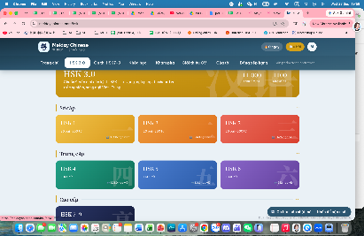  
Với mục từ vựng thì c muốn là nó có option để chọn, chẳng hạn:  
1/ Danh sách từ vựng  
có thể tham khảo dạng trình bày bảng hoặc kiểu các ô cũng ok, nếu được thì thêm cái loa đọc từ mới vào (kiểu như hình, nếu tiện add được thì code vào luôn, phức tạp quá thì thôi)  
option 1  
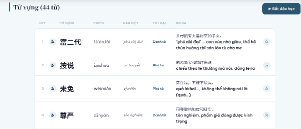  
option 2  
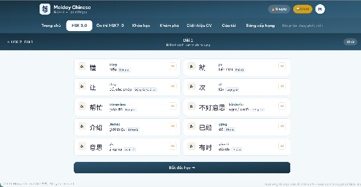  
với cả em có nghĩ là danh mục từ vựng nhiều như vậy, mình nên chia thành các phần 1,2,3,4,5 không, kiểu như dưới, chứ không mà 1 bảng dài quá lướt cũng mệt?, em nghĩa idea phân thử nhé  
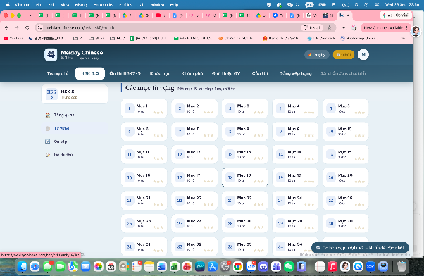

2/ Học theo bài học (cái này thì riêng Từ vựng HSK 3.0 sẽ có theo bài, và chức năng này dành riêng cho học viên MCC/làm sản phẩm đem bán, cho thanh toán và sử dụng)  
chẳng hạn 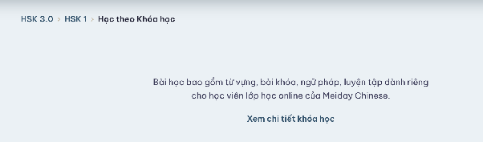  
hoặc mình sẽ thêm kiểu hoặc nhấn vào đây để mua … xong thanh toán …, có thể từ vựng theo bài mỗi cấp độ của new hsk 3.0 chỉ 99k thôi, kiểu v đó\!

3/ Luyện tập (nếu được thì cho vài option như: flashcards/các dạng bài mix ngẫu nhiên câu hỏi \+ chọn đáp án như quizlet, còn không thì chỉ để option luyện tập bằng flashcard thôi)

* ĐỀ THI THỬ  
  * HSK 2.0  
    * HSK1  
    * HSK2  
    * HSK3  
    * HSK4  
    * HSK5  
    * HSK6  
  * HSK 3.0 (hiện tại hsk1-4 có 3 đề, h5-9 chỉ có một đề mẫu)  
    * NEW HSK1  
    * NEW HSK2  
    * ….  
    * NEW HSK9

Link tổng hợp từ vựng: [https://docs.google.com/spreadsheets/d/1wvC1r-Q21f4QBBWLc4zWQ9tbHVXFYJIr2x2V-9I\_0oM/edit?gid=988660719\#gid=988660719](https://docs.google.com/spreadsheets/d/1wvC1r-Q21f4QBBWLc4zWQ9tbHVXFYJIr2x2V-9I_0oM/edit?gid=988660719#gid=988660719)

Link website: [https://mayo-creative-chinese.vercel.app/](https://mayo-creative-chinese.vercel.app/)  
Link đang làm flashcards và test: [https://mayo-creative-chinese.vercel.app/exams](https://mayo-creative-chinese.vercel.app/exams)

# Thay đổi thêm

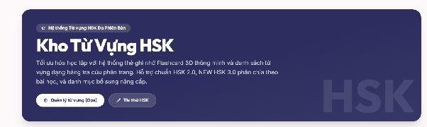  
dòng 1: Hệ thống từ vựng HSK các cấp độ  
KHO TỪ VỰNG TIẾNG TRUNG  
dòng 3: … dạng bảng tra cứu từ vựng tiện lợi.  
đoạn cuối: Hỗ trợ chương trình HSK 2.0, NEW HSK 3.0 các cấp độ và danh mục từ vựng bổ sung chuyển đổi giữa HSK 2.0 và 3.0

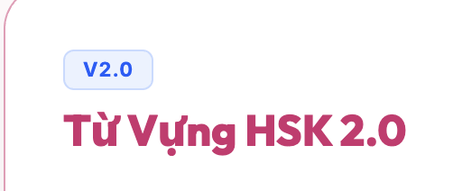  
V2.0 thay thành HSK 2.0 chắc ok hơn

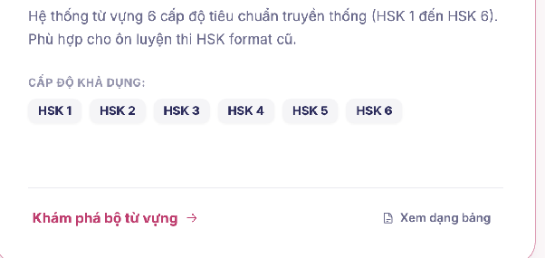  
… theo tiêu chuẩn đánh giá năng lực 6 cấp cũ

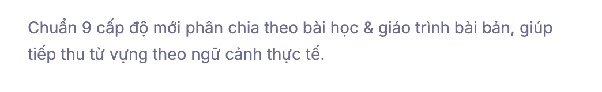  
…theo bài học của giáo trình NEW HSK 3.0

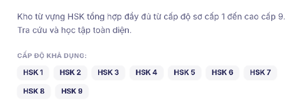  
cao cấp 9 theo Tiêu chuẩn phân cấp trình độ giáo dục Trung văn quốc tế.  
thay thành HSK 7-9 (không chia 7,8,9 nữa huhu)

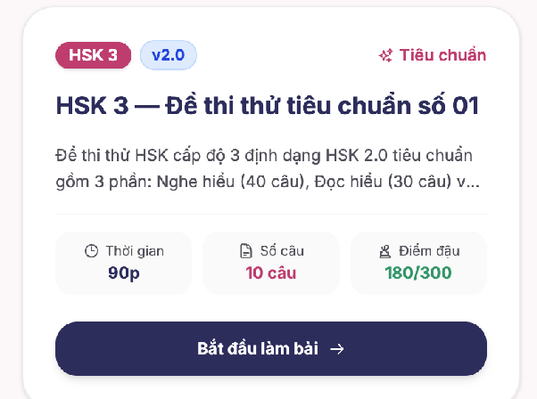  
với cái này chị đang nghĩ là thay tiêu đề “HSK 3 \- ĐỀ THI THỬ 01” là được r

finally, sửa thành tầng 2 nhe  
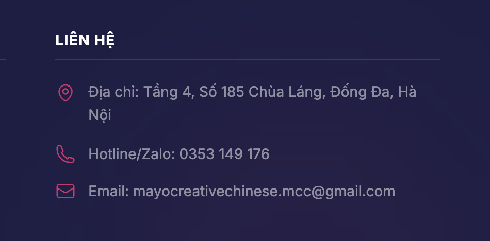

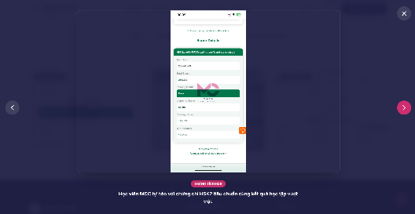  
text nhầm rồi, HSK3 nhá\!

còn cái dưới này là HSK4 267 điểm  
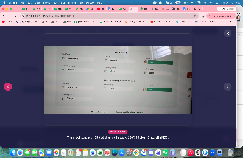  
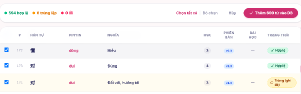  
trường hợp từ vựng nó giống nhưng dùng với nghĩa khác cách dùng khác thế này mà chị vẫn muốn giữ thì có được ko?  
theo chị là nếu "hanzi \+ pinyin \+ meaning" mà đều trùng thì mới ko add, còn lại vẫn đc add từ đó nhé

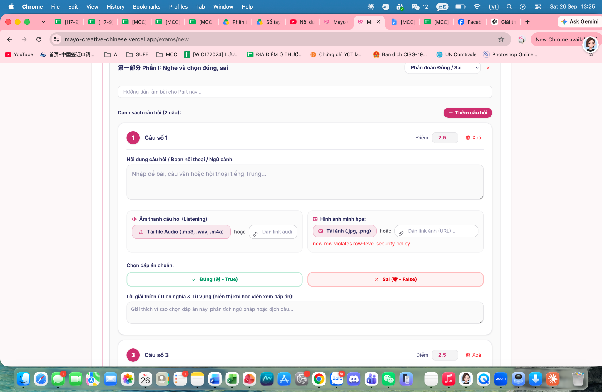  
tải ảnh png lên nhưng web báo lỗi, audio cũng không tải được nhé\!

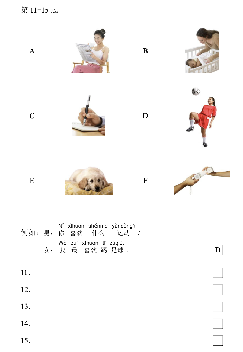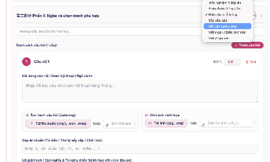  
đối với dạng bài nghe và chọn hình ảnh khớp này thì chưa thấy có dạng bài nào để phù hợp. Ok nhất thì sẽ là có sẵn 1 bức tranh để ở trên sau đó tiến hành để ô điền/chọn đáp án cho từng câu. Vì bài đọc cũng có dạng nhìn tranh như này xong chọn ABCDEF

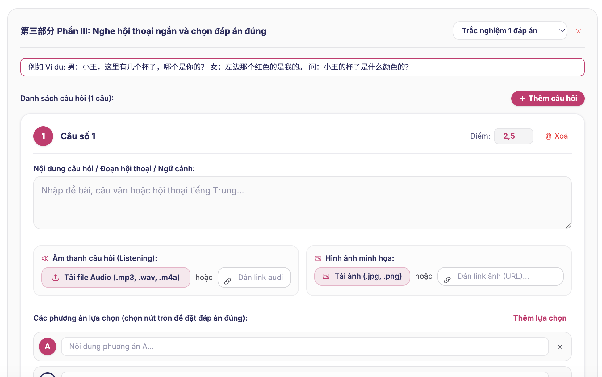  
đoạn này c muốn viết ví dụ kiểu như hướng dẫn làm bài vì audio cũng đọc ví dụ, nhưng không xuống được dòng. Có thể làm option xuống dòng được ko, vì sẽ có 1 đoạn vd như ảnh đã rồi mới đến các câu hỏi làm bài. Part, hướng dẫn làm bài, mấy ô này đều cần xuống dòng được được ko?  
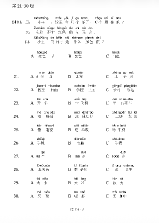  
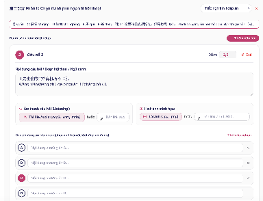ví dụ đề như câu này cũng sẽ cần kiểu 1 ô để để phần từ cho sẵn lên, còn hướng dẫn làm bài thì chắc là sẽ để ví dụ. Giống bên trên các phần nếu có tranh để nối thì mình cũng để sẵn trong 1 ô, tức là ngoài hướng dẫn làm bài ra (GHI SỐ ĐIỂM 1 CÂU/ TỪ CÂU 1-10) kiểu này, thì mình cần 1 cái ô VÍ DỤ/ĐỀ BÀI CHUNG CỦA CẢ PART (kiểu ảnh/từ điền trống)\! Chứ ko   
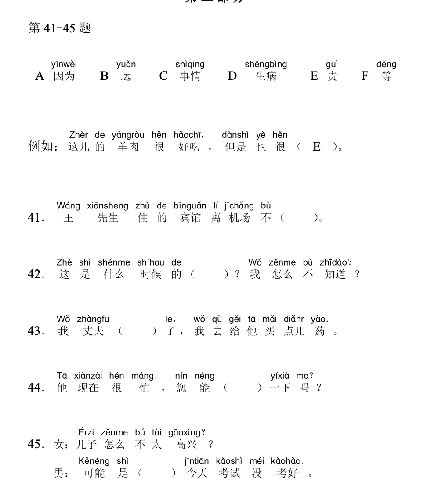  
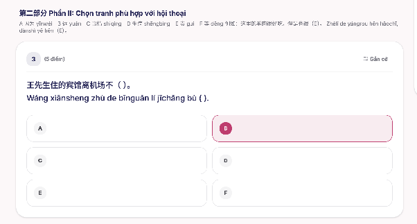  
ví dụ phần này có rất nhiều câu, 6 câu để chọn thì cần làm sao để cái đề nó cố định lại, lướt xuống dưới để tiếp tục làm các câu còn lại

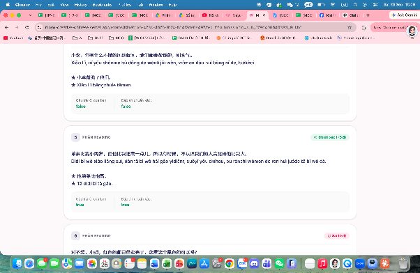  
đáp án chuẩn xác \=\> đáp án chính xác  
và cái true false này mình sag tiếng việt luôn được k, hơi lạc quẻ \=))). Với mấy đoạn part 1 listening  ở đây cũng hiện tiếng anh cũng hơi trộn trộn xíu, chắc cứ đổi tiếng Việt ha cho thống nhất

Ok còn lại thì chưa thấy vấn đề gì thêm, trước mắt v đã ha. Vì c cũng muốn làm 1 lần để có gì còn dùng luôn đỡ phải thay đổi nhiều nên là cố gắng nha

về vụ nên upload đề hay là kiểu cut từng câu thì còn AI nó đề xuất là nên up đề \+ excel câu hỏi gì đó đó. Chị thì không hiểu lắm nhưng mà đúng là nếu nhanh nhất thì sẽ up kiểu file excel danh sách câu hỏi, xong phần ảnh khó xử lý thì kiểu mình tự cut xong paste được ảnh vào thì hay. Vì nếu cut nguyên ảnh thì tiết kiệm thời gian chứ nếu ngồi soạn từng câu thì đúng là hơi lâu thật. Em tính thử lại phương án này, có gì có thể dùng claude của chị để xử lý nhé\! Và liệu có thể duplicate được đề k nhỉ  
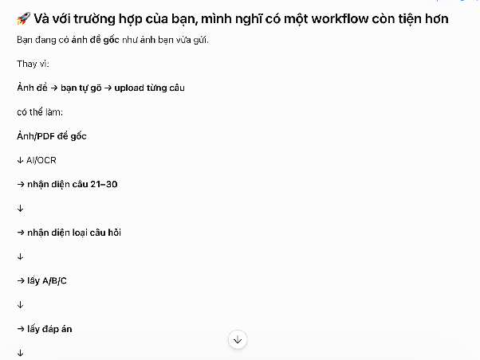  
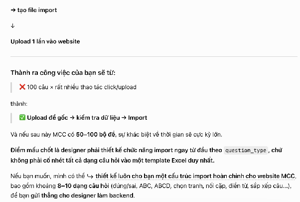

# Adding

**1/ Bài đăng**   
Bài đăng thành tích học viên HSK3,4,5 mới ở MCC  
Post 1: Câu chuyện người đi làm học HSK5  
Theo bạn, người đi làm bận rộn có thể học tiếng Trung không? Điều quan trọng nhất để chinh phục một ngôn ngữ khó như tiếng Trung là gì?

Không phải là năng khiếu bẩm sinh, cũng chẳng phải là việc bạn có toàn bộ thời gian trong ngày chỉ để ngồi vào bàn học. Điều quan trọng nhất, có lẽ là sự kiên trì ngay cả những lúc lịch trình của bạn bận rộn nhất.

MCC đồng hành cùng chị Yến Ngọc từ những ngày đầu tiên, khi chị bắt đầu từ con số 0 tròn trĩnh. Suốt chặng đường dài đó, chị vừa đi làm, vừa học. Có những khoảng thời gian công việc bận rộn, dù phải di chuyển nhiều nhưng chị vẫn đều đặn đến lớp offline. Sự nỗ lực lặng lẽ đó là điều mà tập thể giáo viên và đội ngũ MCC luôn cực kỳ trân trọng.

Khi lên lớp HSK5.002, chị chuyển sang học lớp online trực tiếp với giáo viên người Trung Quốc. Ở cấp độ HSK5, lượng từ vựng và ngữ pháp đã tăng lên rất nhiều. Nhưng chính nhờ nền tảng vững từ đầu kết hợp với môi trường tương tác 100% tiếng Trung, kỹ năng nghe và nói của chị tiến bộ rõ rệt qua từng buổi học. Chị nghe tự nhiên hơn, nói trôi chảy và chủ động hơn rất nhiều.

Nhìn lại cả một chặng đường dài từ HSK1 đến khi cầm trên tay tấm bằng HSK5, MCC thật sự rất xúc động và tự hào.

Chúc mừng chị Yến Ngọc đã hoàn thành xuất sắc mục tiêu của mình. Cảm ơn chị vì đã tin tưởng và chọn MCC làm người đồng hành từ những bước chân đầu tiên\!  
[Link ảnh các post chung 1 link này](https://drive.google.com/drive/folders/10JcdGf_NMHbiWDzwV_v0w-n5xpFSLM65?usp=sharing)

Post 2:   
Khi HSK không chỉ là học để đủ điểm đỗ  
Trong kỳ thi HSK ngày 18/07/2026 vừa qua, các học viên MCC đã chính thức nhận về những kết quả thật đáng tự hào. Đằng sau mỗi con số là cả một quá trình học tập, ôn luyện chăm chỉ của các bạn và sự đồng hành sát sao của giáo viên MCC  
Cùng MCC vinh danh những gương mặt xuất sắc trong của trung tâm trong kỳ thi HSK vừa qua:  
🏆 Đỗ Khánh Linh – HSK3: 292/300  
🏆 Nguyễn Ngọc Hà – HSK3: 292/300  
→ Đặc biệt, cả hai bạn đều chinh phục HSK3 chỉ sau 2,5 tháng học lớp HSK1-3 cấp tốc.  
🏆 Khánh Huyền – HSK3: 292/300  
🏆 Mai Linh – HSK3: 292/300  
🏆 Tùng Dương – HSK3: 278/300  
🏆 Trương Hồng Phúc – HSK3: 226/300  
🏆 Minh Nguyệt – HSK4: 234/300  
Điều MCC vui nhất không chỉ là nhìn thấy những con số trên bảng điểm, mà còn là được chúc mừng những nỗ lực và sự tiến bộ của từng học viên. 🎉  
📚 Trên lớp, các bạn được học theo lộ trình, củng cố kiến thức và làm quen với dạng bài HSK.  
💬 Ngoài giờ học, học viên vẫn có thể trao đổi, hỏi bài và nhận thêm hỗ trợ trong quá trình ôn tập.  
🎯 Quan trọng nhất vẫn là sự chủ động, chăm chỉ và nỗ lực của mỗi bạn trong suốt hành trình học tập.  
Và dù học ONLINE hay OFFLINE, MCC vẫn mong muốn mang đến một môi trường học tập chất lượng để các bạn yên tâm theo đuổi mục tiêu của mình.  
🎉 Một lần nữa, chúc mừng tất cả các học viên MCC đã hoàn thành kỳ thi và đạt được những kết quả thật đáng tự hào\!  
Cảm ơn các bạn đã lựa chọn MCC trên hành trình chinh phục tiếng Trung. Chúc các bạn sẽ tiếp tục giữ vững tinh thần này và chinh phục những cột mốc tiếp theo\!

Post 3:    
Không khí lớp học offline tại MCC luôn vô cùng sôi động\! 🩷

Tại MCC, các bạn không chỉ học từ vựng, ngữ pháp mà còn được luyện nói và giao tiếp ngay từ đầu giờ, cùng nhau tương tác trong suốt buổi học và thực hành lại kiến thức vào cuối buổi. 🗣️✨

Mỗi buổi học là một cơ hội để các bạn nói nhiều hơn, phản xạ nhanh hơn và tự tin sử dụng tiếng Trung hơn. 🇨🇳📚

Cùng xem một chút “vibe” lớp học nhà MCC nhé\! 💕

[Post 4:](https://drive.google.com/drive/folders/1YGfhl1SVrjA7rVarqvp4XLdzMB_hdmK-?usp=drive_link)   
🌟GIÁO VIÊN HSK6 có học viên đạt HSK6 là cảm giác như thế nào?🌟  
Đó là cảm giác như nhìn thấy một hạt giống nhỏ bé mình gieo từ cuối năm 2023… hôm nay nở thành một bông hoa rực rỡ.  
Cuối năm 2023, Tường Vân bắt đầu tiếng Trung từ con số 0, bước những bước chân đầu tiên dưới sự dẫn dắt của “chị giáo” Lưu Ngọc Mai. Từ những buổi học phát âm b, p, m đầu tiên, vậy mà sau hơn 1 năm kiên trì, bền bỉ, hôm nay em đã xuất sắc chinh phục HSK6 với 216/300 điểm – một cột mốc mà nhiều nhiều người học tiếng Trung cũng mơ ước.  
Trong suốt hành trình đó, Vân luôn là cô học viên chăm chỉ, tham gia học và nộp bài đầy đủ, còn luôn chủ động hỏi thêm, tìm hiểu sâu hơn về bài nữa. Và rồi những nỗ lực thầm lặng ấy đã kết trái.  
Không chỉ là điểm số — đây là một dấu mốc trưởng thành, là minh chứng cho hành trình học thuật bền bỉ mà đội ngũ MCC luôn tự hào được đồng hành cùng học viên.  
Cảm ơn Vân vì đã tin tưởng và lựa chọn đồng hành cùng “chị giáo”.  
Cảm ơn vì đã chứng minh rằng: chỉ cần đủ quyết tâm, tiếng Trung không hề khó – chỉ cần ta đừng bỏ cuộc.  
Chúc mừng em, Phan Nguyễn Tường Vân.  
Chặng đường HSK6 chỉ là khởi đầu — phía trước còn rất nhiều cánh cửa đẹp đang đợi em mở ra.

Post 5: CUỘC THI VIẾT CHỮ HÁN TẾT: 笔墨迎春 – XUÂN TRONG NÉT CHỮ  
✨ Họ và tên học viên: Phạm Bình Phương Khuê  
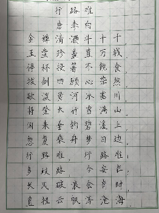  
**2/ Lộ trình chi tiết các khoá học ở MCC**  
**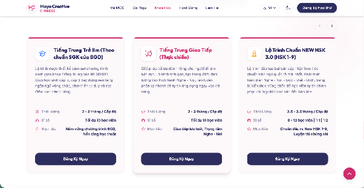**  
1/ Chắc đoạn này là khoá học xong mình sẽ cho kiểu lộ trình chi tiết từng khoá học vào, nên đoạn Đăng ký ngay sẽ thành “Xem chi tiết lộ trình”

2/ Bổ sung thêm 2 khoá học là 

**Bổ sung kiến thức HSK 2.0 lên HSK 3.0**  
Dành riêng cho học viên đã có nền tảng HSK 2.0 (đã học xong HSK3 theo format 2.0) muốn bổ sung phần kiến thức, từ vựng, ngữ pháp chênh lệch để chuyển tiếp sang học và thi theo cấu trúc đề HSK 3.0 mới mà không phải học lại từ đầu.  
Thời lượng: 3 tuần  
Sĩ số: 10 học viên  
Mục tiêu: Học và thi chứng chỉ theo HSK mới 3.0

**Gia sư 1:1 và 1:2**  
Được xây dựng lộ trình học riêng theo mục tiêu của học viên (thi HSK, cải thiện giao tiếp, bổ trợ kiến thức trên lớp, v.v.), linh hoạt về nội dung và thời gian.  
Thời lượng: 2-5 buổi/tuần  
Sĩ số: 1-2 học viên

3/ Ok giờ đến đoạn chi tiết trong mỗi khoá học sẽ có gì:

* Title: Tên khoá học và mục tiêu khoá học  
* Nội dung bên dưới gồm (có thể chia dạng bố cục trái phải trên dưới gì đó)  
  * Lộ trình học chi tiết:  
  * Thông tin khoá học:  
    * Thời lượng: … buổi, … buổi/tuần (\~ … tháng)  
    * Sĩ số: 8-10 bạn  
    * Cam kết đầu ra:   
    *   
    * Đăng ký ngay

	Dưới cùng có thể thêm kiểu

* Hình ảnh lớp học MCC (hoặc mấy cái bài thành tích học viên, feedback học viên) hoặc kiểu  
  * Học thử miễn phí với MCC nhé\! 

[**Sử dụng dữ liệu trong file sau để làm nội dung nhé em nhé\!\!\!**](https://docs.google.com/document/d/13IfXMiOR3OMN-cIvlrio1I5Jvnt29sqE/edit?usp=sharing&ouid=101246134863796335998&rtpof=true&sd=true)

**3/ Sửa và thêm pro5 giáo viên**  
Add pro5 gvien Linh \+ Mai mới, 2 trợ giảng Tâm và Huyền Anh

# **Chị giáo: Lê Thị Linh**

Lê Thị Linh, Cử nhân **Xuất sắc**, ngành Ngôn ngữ Trung Quốc, Trường Đại học Ngoại ngữ – Đại học Huế (2026), GPA: 3.68/4  
\- Sinh viên xuất sắc khoa Trung đạt **Học bổng Khuyến khích học tập** của trường.  
\- Chứng chỉ **HSK 6, HSKK Cao cấp (2026)**.  
\- Chứng chỉ Nghiệp vụ sư phạm Đại học (2026)  
\- Hơn 01 năm kinh nghiệm giảng dạy tiếng Trung, hơn 02 năm trợ giảng tiếng Trung  
\- Kinh nghiệm làm việc với các công ty Trung Quốc tại Việt Nam.

**Chị giáo: Nguyễn Thị Thuý Mai**  
Nguyễn Thị Thuý Mai, ngành Quan hệ Quốc tế \- Học viện Ngoại giao  
\- Cựu học sinh chuyên Tiếng Trung tại THPT Chuyên Chu Văn An, Lạng Sơn  
\- HSK6, HSKK Cao cấp (03/2023)  
\- Hơn 03 năm kinh nghiệm giảng dạy Tiếng Trung, đặc biệt là các lớp trình độ HSK1–HSK5 và các lớp giao tiếp; có kinh nghiệm giảng dạy 1-1 và nhóm nhỏ.  
\- Giải Nhì Học sinh giỏi Tiếng Trung cấp tỉnh lớp 12, Huy chương Bạc Trại hè Hùng Vương 2022, Đội tuyển Học sinh giỏi Tiếng Trung cấp Quốc gia  
\- 01 năm kinh nghiệm làm Cộng tác viên Học thuật HSK, tham gia xây dựng và kiểm duyệt nội dung học tập liên quan đến HSK  
\- 01 năm kinh nghiệm nghiên cứu về Trung Quốc học và Quan hệ Quốc tế, khai thác và sử dụng tài liệu tiếng Trung trong nghiên cứu học thuật  
\- Thực tập sinh tại Viện Nghiên cứu Chiến lược Ngoại giao, tham gia các hoạt động nghiên cứu và xử lý tài liệu

Sửa pro5 Ly, Thảo

# **Chị giáo: Nguyễn Thị Phương Thảo**

**NGUYỄN THỊ PHƯƠNG THẢO,** Nghiên cứu sinh thạc sĩ chuyên ngành Ngôn ngữ Trung Quốc \- Trường Đại học Hà Nội (HANU)  
\- Cử nhân loại Giỏi chuyên ngành Tiếng Trung thương mại Trường Đại học Ngoại thương, song ngành Kinh tế đối ngoại  
\- HSK6, HSKK Cao cấp (Năm 2023\)  
\- Co-founder Mayo Creative Chinese (MCC)  
\- Chứng chỉ nghiệp vụ sư phạm (năm 2025\)  
\- Hơn 03 năm trong việc dạy gia sư, ôn thi HSK từ sơ cấp đến cao cấp, đồng hành cùng hàng nghìn bạn học sinh, sinh viên trên hành trình học tiếng Trung và chinh phục các kỳ thi HSK3-4-5.  
\- Hơn 02 năm kinh nghiệm giảng dạy tại các trung tâm tiếng online và tại Hà Nội  
\- Hơn 01 năm kinh nghiệm làm việc trong các lĩnh vực logistics và thương mại với đối tác Trung Quốc  
\- Nhiệt tình, sát sao với học viên, luôn được học viên yêu thích vì phong cách giảng dạy hấp dẫn, không khí học tập vui vẻ

# **Chị giáo: Nguyễn Hương Ly**

**NGUYỄN HƯƠNG LY**, Nghiên cứu sinh Thạc sĩ chuyên ngành Giáo dục Hán ngữ quốc tế \- Đại học Lan Châu (兰州大学）  
\- Cử nhân loại Giỏi chuyên ngành Kinh tế đối ngoại (Ngoại ngữ: tiếng Trung) \- Trường Đại học Ngoại thương  
\- Chứng chỉ nghiệp vụ sư phạm (năm 2025\)  
\- HSK6, HSKK Cao cấp (Năm 2025\)  
\- Đạt chứng chỉ HSK5 (Năm 2021), HSK4(2020)  
\- Thủ khoa môn tiếng Trung tỉnh Lạng Sơn năm 2021 với điểm số tuyệt đối 10/10  
\- Đỗ chương trình nghiên cứu sinh Thạc sĩ chuyên ngành Giáo dục Hán ngữ quốc tế trường Đại học An Huy (安徽大学）  
\- Đỗ học bổng toàn phần hệ Thạc sĩ chuyên ngành Giáo dục Hán ngữ quốc tế \- Đại học Lan Châu (兰州大学）  
\- GPA 3.6 7/7 học phần tiếng Trung  
\- Hơn 04 năm kinh nghiệm gia sư, đứng lớp môn Tiếng Trung (cho học sinh, sinh viên)  
\- Hơn 01 năm kinh nghiệm dạy tiếng Việt cho người Trung  
\- 01 năm kinh nghiệm lễ tân Tiếng Trung tại Hanoi Old Quarter Spa; kinh nghiệm làm việc với đối tác người Trung trong các lĩnh vực thương mại, logistics,...  
\- Thực tập sinh bộ phận thu mua \+ vận hành tiktok tại công ty TNHH Thương Mại và Dịch Vụ Quán Phong \- công ty hoạt động trên lĩnh vực xuất nhập khẩu
