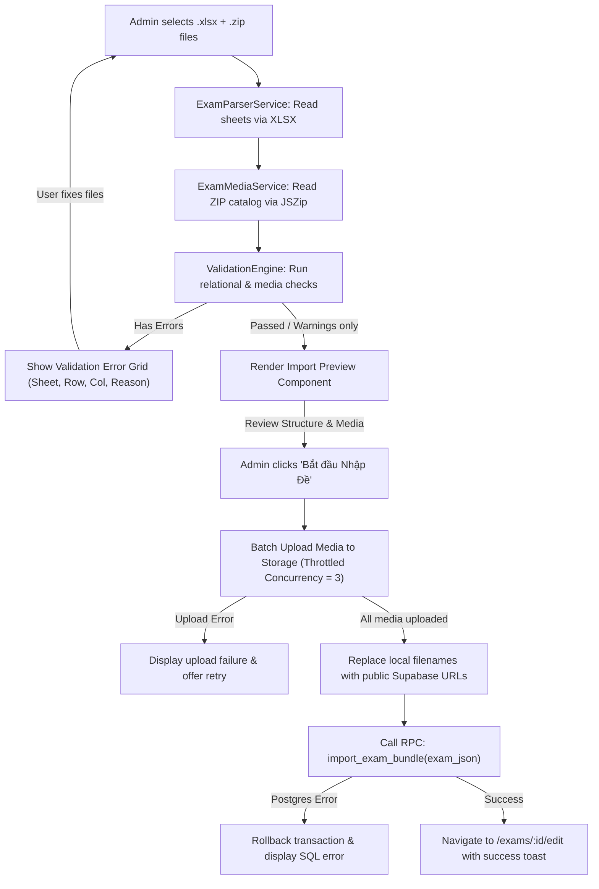

# Implementation Plan: Template-Based HSK Exam Import System

> **Document Location:** `docs/plans/exam-import-plan.md`  
> **Target Platform:** Mayo Creative Chinese (MCC)  
> **Stack:** Angular 21 (Signals, Zoneless, Control Flow), Tailwind CSS v4, Supabase (PostgreSQL 15, PostgREST, Storage), Vercel  
> **Scope:** Planning document only. No code, migrations, or dependencies modified during this phase.

---

## 1. Open Questions for Human Review

The following questions contain decisions that cannot be inferred solely from the codebase. Recommended defaults are provided:

1. **Re-import / Idempotency Overwrite Policy**:
   * *Question*: When an admin uploads an `.xlsx` with an `exam_code` that already exists in the database, should the system:
     - (A) Completely overwrite the exam structure (replace sections, parts, groups, questions, options) automatically? (Recommended default)
     - (B) Prompt the admin with an explicit "Exam exists: Overwrite or Cancel?" confirmation modal?
     - (C) Reject the import if any student submissions exist for this `exam_code`?
   * *Recommendation*: Option (B) in UI, backed by Option (A) in the atomic Postgres RPC function. (Submissions are currently stored only in `localStorage`, so no DB foreign key constraint blocks overwrites).

2. **ZIP Directory Layout Flexibility**:
   * *Question*: How strictly should media file paths inside the ZIP be validated?
     - (A) Require exact relative paths (e.g. `media/audio/q1.mp3`)?
     - (B) Flexible filename-only matching: extract all files, index by lowercase basename (e.g. `q1.mp3`), ignoring internal folder hierarchy? (Recommended default)
   * *Recommendation*: Option (B). Teachers frequently zip folders with inconsistent wrapping (e.g., zipping the parent folder vs. zipping contents directly).

3. **Strictness of `exam_specs` Conformance**:
   * *Question*: If an uploaded exam deviates from the official HSK specification (for example, HSK 3 Listening has 38 questions instead of 40, or total score is 280 instead of 300):
     - (A) Hard validation error (block import completely)?
     - (B) Warning banner during preview (allow admin to proceed with import)? (Recommended default)
   * *Recommendation*: Option (B). Mock tests, practice mini-tests, and customized center drills need flexibility to import fewer questions.

4. **Matching Question Model & Grading**:
   * *Question*: How should HSK Part 1 Reading/Listening matching (e.g., 5 questions sharing a bank of 5–6 picture options A–F) be imported and graded?
     - (A) Modeled as 5 individual `single_choice` questions linked to a shared `exam_groups` record containing the shared stimuli? (Recommended default)
     - (B) Modeled as a single composite question with a complex JSON payload and all-or-nothing grading?
   * *Recommendation*: Option (A). This preserves granular per-question scoring (e.g., 2.5 points per correct match), reuses existing option schema, and fits the group stimulus architecture cleanly.

5. **Storage Asset Lifecycle on Re-import**:
   * *Question*: When an exam is re-imported and media files are replaced, should existing media files in Supabase Storage bucket `exam-assets` under `exams/{exam_code}/` be overwritten (`upsert: true`) or cleaned up?
   * *Recommendation*: Use namespaced paths `exams/{exam_code}/{filename}` with `upsert: true`. This prevents orphan files and keeps filenames predictable.

---

## 2. Discovery Findings

Every finding below has been verified against the physical files in `e:\MayoCreativeChinese`:

| Item | Status | Evidence (File & Line References) | Notes / Detail |
| :--- | :---: | :--- | :--- |
| **1. Existing Question Types** | **Confirmed** | [src/app/features/exams/models/exam.model.ts#L11-L18](file:///e:/MayoCreativeChinese/src/app/features/exams/models/exam.model.ts#L11-L18)<br>[src/app/features/exams/data/001-exam-schema.sql#L49-L57](file:///e:/MayoCreativeChinese/src/app/features/exams/data/001-exam-schema.sql#L49-L57)<br>[src/app/features/exams/pages/exam-take/exam-take.html#L365-L520](file:///e:/MayoCreativeChinese/src/app/features/exams/pages/exam-take/exam-take.html#L365-L520)<br>[src/app/features/exams/services/exam.service.ts#L446-L471](file:///e:/MayoCreativeChinese/src/app/features/exams/services/exam.service.ts#L446-L471) | 7 types declared: `single_choice`, `true_false`, `fill_blank`, `ordering`, `matching`, `short_answer`, `essay`.<br>• `single_choice`: grid of option buttons.<br>• `true_false`: True/False buttons.<br>• `fill_blank`: `<input>`.<br>• `ordering`: badge builder + sequence token buttons.<br>• `short_answer` / `essay`: `<textarea>`.<br>• **CRITICAL GAP**: `matching` is declared in TypeScript and SQL CHECK constraint, but has **no rendering branch** in `exam-take.html`; falls through to `<textarea>`. |
| **2a. Image Support: Question Stems** | **Confirmed** | [src/app/features/exams/data/001-exam-schema.sql#L72](file:///e:/MayoCreativeChinese/src/app/features/exams/data/001-exam-schema.sql#L72)<br>[src/app/features/exams/pages/exam-take/exam-take.html#L348-L352](file:///e:/MayoCreativeChinese/src/app/features/exams/pages/exam-take/exam-take.html#L348-L352)<br>[src/app/features/exams/pages/exam-result/exam-result.html#L289-L293](file:///e:/MayoCreativeChinese/src/app/features/exams/pages/exam-result/exam-result.html#L289-L293)<br>[src/app/features/exams/components/question-editor/question-editor.html#L68-L72](file:///e:/MayoCreativeChinese/src/app/features/exams/components/question-editor/question-editor.html#L68-L72) | **User belief refuted**: Stored in `exam_questions.image_url`. Fully rendered in exam taker (`@if (q.image_url)`), exam result review, and manual question editor via `<app-image-uploader>`. |
| **2b. Image Support: Answer Options** | **Confirmed (Partial)** | [src/app/features/exams/data/001-exam-schema.sql#L88](file:///e:/MayoCreativeChinese/src/app/features/exams/data/001-exam-schema.sql#L88)<br>[src/app/features/exams/pages/exam-take/exam-take.html#L392-L394](file:///e:/MayoCreativeChinese/src/app/features/exams/pages/exam-take/exam-take.html#L392-L394) | **User belief refuted**: DB table `exam_options` has `image_url TEXT`. Player renders option images (`@if (opt.image_url) {  }`).<br>*Gap*: Manual editor (`question-editor.html`) lacks image upload for individual options; `exam-result.html` only prints text answer. |
| **3. Audio & Shared Audio/Passages** | **Confirmed (Partial)** | [src/app/features/exams/data/001-exam-schema.sql#L38](file:///e:/MayoCreativeChinese/src/app/features/exams/data/001-exam-schema.sql#L38)<br>[src/app/features/exams/data/001-exam-schema.sql#L71](file:///e:/MayoCreativeChinese/src/app/features/exams/data/001-exam-schema.sql#L71)<br>[src/app/features/exams/pages/exam-take/exam-take.html#L203-L250](file:///e:/MayoCreativeChinese/src/app/features/exams/pages/exam-take/exam-take.html#L203-L250)<br>[src/app/features/exams/pages/exam-take/exam-take.html#L341-L345](file:///e:/MayoCreativeChinese/src/app/features/exams/pages/exam-take/exam-take.html#L341-L345) | Audio is supported at Section level (`exam_sections.audio_url` with sticky player) and Question level (`exam_questions.audio_url`).<br>**Shared audio/passages across group: Not found**. No "groups" table or concept exists. Hierarchy is flat: Section -> Part -> Question. |
| **4. DB Schema & Supabase CLI** | **Confirmed** | [src/app/features/exams/data/001-exam-schema.sql](file:///e:/MayoCreativeChinese/src/app/features/exams/data/001-exam-schema.sql)<br>[src/app/features/exams/data/002-exam-seed-data.sql](file:///e:/MayoCreativeChinese/src/app/features/exams/data/002-exam-seed-data.sql)<br>[package.json](file:///e:/MayoCreativeChinese/package.json) | 5 tables: `exams`, `exam_sections`, `exam_parts`, `exam_questions`, `exam_options`.<br>**Supabase CLI: Not found**. No `supabase/` folder, no `config.toml`, no migration tracking. All SQL has been run manually via Supabase web dashboard. |
| **5. Storage Buckets & RLS State** | **Confirmed** | [src/app/features/exams/services/exam.service.ts#L19](file:///e:/MayoCreativeChinese/src/app/features/exams/services/exam.service.ts#L19)<br>[src/app/features/exams/data/001-exam-schema.sql#L125-L135](file:///e:/MayoCreativeChinese/src/app/features/exams/data/001-exam-schema.sql#L125-L135) | Storage bucket: `exam-assets`, subfolders `audio/` and `images/`. Public URLs retrieved via `getPublicUrl()`.<br>RLS state: Enabled on all tables, but has fully open policies (`FOR ALL USING (true) WITH CHECK (true)`). Public anon key has read/write. |
| **6. Existing Import & HSK Format Logic** | **Confirmed (Flashcards only)** | [src/app/features/flashcards/utils/file-parser.util.ts](file:///e:/MayoCreativeChinese/src/app/features/flashcards/utils/file-parser.util.ts)<br>[src/app/features/flashcards/utils/template-generator.util.ts](file:///e:/MayoCreativeChinese/src/app/features/flashcards/utils/template-generator.util.ts)<br>[src/app/features/flashcards/components/import-preview/import-preview.ts](file:///e:/MayoCreativeChinese/src/app/features/flashcards/components/import-preview/import-preview.ts)<br>[src/app/features/exams/pages/exam-editor/exam-editor.ts#L61-L100](file:///e:/MayoCreativeChinese/src/app/features/exams/pages/exam-editor/exam-editor.ts#L61-L100) | No exam import exists.<br>Flashcards module has XLSX parsing, template download, and preview modal.<br>HSK format logic: `exams.hsk_version` ('2.0' \| '3.0') exists as a column; `initDefaultStructure()` hardcodes HSK 3 parts. No dynamic spec configuration exists. |
| **7. Libraries & Angular Conventions** | **Confirmed** | [package.json#L25](file:///e:/MayoCreativeChinese/package.json#L25)<br>[package.json#L14-L20](file:///e:/MayoCreativeChinese/package.json#L14-L20) | `xlsx`: `^0.18.5` is installed.<br>`jszip`: **Not installed**.<br>Angular: `21.2.0` (Zoneless, Signals, Control Flow `@if/@for`, Standalone components). Tailwind CSS v4. |

---

## 3. Gap Analysis & Risk Assessment

### 3.1 Gap Analysis Matrix

| Dimension | Current State | Target State | Gap to Bridge |
| :--- | :--- | :--- | :--- |
| **Data Hierarchy** | Exam &rarr; Section &rarr; Part &rarr; Question &rarr; Option (4 tiers) | Exam &rarr; Section &rarr; Part &rarr; **Group** (optional) &rarr; Question &rarr; Option (5 tiers) | Add `exam_groups` table with `passage`, `audio_url`, `image_url` for multi-question stimulus sets. Add `group_id` FK to `exam_questions`. |
| **Exam Identity & Idempotence** | Only UUID `id`. No business code. | Unique `exam_code` (e.g. `HSK3-20-01`). | Add `exam_code VARCHAR(50) UNIQUE` to `exams`. Update import pipeline to perform atomic upsert/replace. |
| **Question Extensibility** | Hardcoded SQL CHECK on `exam_parts.question_type`. Monolithic `@if/@else` in `exam-take.html`. Flat columns only. | Extensible Question Plugins: `type` + `payload JSONB` on questions and options + standalone renderer + grader function. | Add `payload JSONB NOT NULL DEFAULT '{}'::jsonb` to `exam_questions` and `exam_options`. Drop rigid CHECK constraint on `exam_parts.question_type`. Create `QuestionPluginRegistry`. |
| **HSK Spec Configuration** | Hardcoded in `initDefaultStructure()` for HSK 3 only. | Dynamic `exam_specs` table defining structure, question counts, duration, and score per level/version. | Create `exam_specs` table; seed HSK 2.0 (L1–L6) and HSK 3.0 (L1–L9) specifications. |
| **Import Bundle Format** | None for exams. | Standardized `.xlsx` template (5 sheets) + `.zip` for media assets. | Define exact sheet schemas, column keys, sample templates, and ZIP extraction engine using `jszip`. |
| **Media Resolution** | Single manual file picker per question/section. | Relative filenames in Excel (`q1_audio.mp3`) resolved to ZIP entries, uploaded to Supabase Storage, mapped to public URLs. | Build browser-side `ExamMediaService` with concurrency throttling and filename matching. |
| **Import Transaction** | Manual form save via multiple iterative PostgREST calls in `ExamService.saveExam()`. Non-atomic. | Single atomic database RPC `import_exam_bundle(exam_json JSONB)` running inside a PostgreSQL transaction. | Implement stored procedure with rollback on any constraint violation. |
| **Supabase CLI Workflow** | Loose `.sql` files pasted into dashboard. | Standardized `supabase/migrations/*.sql` directory with sequential timestamps. | Initialize `supabase/config.toml` and create baseline + additive migration scripts. |

### 3.2 Risks & Mitigation Strategies

1. **Client Memory Exhaustion with Large Audio ZIPs**:
   * *Risk*: A full HSK 5/6 listening bundle may include 50+ MP3 clips and full section audio (up to 150MB). Unzipping entirely in browser memory could crash low-spec devices.
   * *Mitigation*: Process files sequentially from `JSZip` as `Blob` streams rather than loading all decompressed buffers into memory simultaneously. Throttle Supabase Storage uploads to 3 concurrent connections.
2. **Vercel Serverless Payload Limits**:
   * *Risk*: Vercel functions have a 4.5MB request body ceiling.
   * *Mitigation*: The entire file extraction, validation, and media upload occurs **directly in the client browser** to Supabase Storage. The serverless layer is bypassed; only the lightweight JSON metadata (~50KB) is sent to Supabase RPC.
3. **Database Constraint Regressions**:
   * *Risk*: Changing `exam_parts.question_type` or adding `exam_groups` might break existing seeded exams (`002-exam-seed-data.sql`).
   * *Mitigation*: All migrations are strictly **additive**. Existing columns (`content`, `audio_url`, `image_url`) remain untouched; `group_id` is nullable; `payload` defaults to `'{}'::jsonb`.

---

## 4. Design Proposal

### 4.1 Template Specification (`.xlsx` + ZIP)

An exam bundle consists of:
1. `exam.xlsx` (Workbook containing 5 mandatory sheets)
2. `media/` (Directory inside `.zip` containing all referenced audio `.mp3/.wav` and image `.png/.jpg/.webp` files)

#### Sheet 1: `exams` (Exactly 1 row)
| Column | Type | Required | Description / Rules | Example |
| :--- | :--- | :---: | :--- | :--- |
| `exam_code` | String | **Yes** | Unique business identifier. Idempotence key. Regex: `^[A-Za-z0-9_-]{3,50}$` | `HSK3-20-01` |
| `title` | String | **Yes** | Full display title. Max 255 chars. | `HSK 3 — Đề thi thử tiêu chuẩn số 01` |
| `hsk_version` | Enum | **Yes** | `2.0` or `3.0` | `2.0` |
| `hsk_level` | Int | **Yes** | `1` to `6` (for 2.0) or `1` to `9` (for 3.0) | `3` |
| `duration_mins` | Int | **Yes** | Test duration in minutes (10–240) | `90` |
| `total_score` | Int | **Yes** | Maximum score (usually 200 or 300) | `300` |
| `passing_score`| Int | **Yes** | Passing threshold (usually 120 or 180) | `180` |
| `description` | String | No | General instructions or overview | `Đề thi thử định dạng HSK 2.0 chuẩn.` |
| `is_published` | Boolean| No | `TRUE` or `FALSE` (defaults to `FALSE`) | `FALSE` |

#### Sheet 2: `sections`
| Column | Type | Required | Description / Rules | Example |
| :--- | :--- | :---: | :--- | :--- |
| `section_code` | String | **Yes** | Unique within workbook (e.g. `SEC_LIS`, `SEC_READ`) | `SEC_LIS` |
| `section_type` | Enum | **Yes** | `listening`, `reading`, `writing`, `speaking` | `listening` |
| `title` | String | **Yes** | Display title | `Phần 1: Nghe hiểu (听力)` |
| `sort_order` | Int | **Yes** | Sequence order (1, 2, 3...) | `1` |
| `max_score` | Int | **Yes** | Section score ceiling (typically 100) | `100` |
| `instructions` | String | No | Instructions displayed to student | `Gồm 40 câu hỏi, thời gian nghe 35 phút.` |
| `audio_file` | String | No | Filename in ZIP for continuous section listening track | `hsk3_sec1_full.mp3` |

#### Sheet 3: `parts`
| Column | Type | Required | Description / Rules | Example |
| :--- | :--- | :---: | :--- | :--- |
| `part_code` | String | **Yes** | Unique within workbook (e.g. `P_LIS_1`) | `P_LIS_1` |
| `section_code` | String | **Yes** | Must match a `section_code` in `sections` sheet | `SEC_LIS` |
| `title` | String | **Yes** | Part title | `Phần I: Câu 1-10 (Chọn hình phù hợp)` |
| `question_type`| String | **Yes** | Registered plugin type identifier (e.g. `single_choice`) | `single_choice` |
| `instructions` | String | No | Instructions specific to this part | `Nghe đối thoại và chọn bức tranh tương ứng.` |
| `sort_order` | Int | **Yes** | Sequence within section | `1` |

#### Sheet 4: `groups` (Optional sheet or empty if no shared stimuli)
| Column | Type | Required | Description / Rules | Example |
| :--- | :--- | :---: | :--- | :--- |
| `group_code` | String | **Yes** | Unique within workbook (e.g. `GRP_READ_1`) | `GRP_READ_1` |
| `part_code` | String | **Yes** | Must match a `part_code` in `parts` sheet | `P_READ_2` |
| `title` | String | No | Optional subtitle (e.g. `Đoạn văn số 1`) | `Đoạn đối thoại 1 (Câu 21-25)` |
| `passage` | String | No | Shared reading text / dialogue in Chinese | `小明每天早上七点起床去学校...` |
| `audio_file` | String | No | Shared audio filename in ZIP | `dialogue_passage_1.mp3` |
| `image_file` | String | No | Shared image filename in ZIP (e.g. picture bank) | `group_scene_1.png` |
| `sort_order` | Int | **Yes** | Sequence within part | `1` |

#### Sheet 5: `questions`
| Column | Type | Required | Description / Rules | Example |
| :--- | :--- | :---: | :--- | :--- |
| `question_num` | Int | **Yes** | Global 1-based index (1, 2, ... N). Must be unique across exam. | `1` |
| `part_code` | String | **Yes** | Must match a `part_code` in `parts` sheet | `P_LIS_1` |
| `group_code` | String | No | Optional. Must match a `group_code` in `groups` sheet | `GRP_READ_1` |
| `stem_text` | String | No | Question prompt / sentence / dialogue | `男：请问洗手间在哪儿？\n女：在前面。` |
| `audio_file` | String | No | Question-specific audio filename in ZIP | `q1_audio.mp3` |
| `image_file` | String | No | Question-specific image filename in ZIP | `q1_picture.png` |
| `correct_answer`| String| **Yes** | Normalized answer key (`A`, `true`, `①④②③`, `天`) | `B` |
| `score` | Decimal| **Yes** | Score weight for this question (e.g. 2.50) | `2.5` |
| `explanation` | String | No | Vietnamese explanation & translation | `Nam hỏi nhà vệ sinh ở đâu -> Chọn B.` |
| `payload_json` | JSON | No | Optional JSON string for plugin-specific settings | `{"layout": "grid_2x2"}` |

#### Sheet 6: `options` (Used by `single_choice` and `matching`)
| Column | Type | Required | Description / Rules | Example |
| :--- | :--- | :---: | :--- | :--- |
| `question_num` | Int | **Yes** | Must match a `question_num` in `questions` sheet | `1` |
| `label` | String | **Yes** | Option label (`A`, `B`, `C`, `D`, `E`, `F`) | `A` |
| `content` | String | No | Text of option. Required if `image_file` is empty. | `教室 (Phòng học)` |
| `image_file` | String | No | Filename of option image in ZIP | `opt_1a.png` |
| `sort_order` | Int | **Yes** | Sequence order | `1` |

---

### 4.2 Browser-Side Validation Engine & Error Model

Validation runs entirely in the browser before any network request is made. If any error is detected, the import is blocked and an actionable error report is presented.

```typescript
export interface ValidationError {
  sheet: 'exams' | 'sections' | 'parts' | 'groups' | 'questions' | 'options' | 'media';
  rowNumber?: number;      // 1-based Excel row number
  column?: string;         // Excel column header
  code: string;            // Machine code, e.g. 'ERR_MISSING_MEDIA'
  message: string;         // Human-readable message in Vietnamese
  severity: 'error' | 'warning';
}
```

#### Validation Rule Matrix:
1. **Workbook Structure**:
   * All 5 primary sheets (`exams`, `sections`, `parts`, `questions`, `options`) must be present.
   * Sheet `exams` must contain exactly 1 data row.
2. **Relational Referencing**:
   * Every `part.section_code` must exist in `sections`.
   * Every `group.part_code` must exist in `parts`.
   * Every `question.part_code` must exist in `parts`.
   * If `question.group_code` is present, it must exist in `groups`.
   * Every `option.question_num` must exist in `questions`.
3. **Data Integrity & Consistency**:
   * `question_num` must be sequentially unique with no duplicates or missing numbers in sequence `1..N`.
   * Sum of `question.score` across all questions must equal `exams.total_score` (tolerance: ±0.05 for rounding).
   * For `single_choice`: `correct_answer` must strictly match one of the `label` entries in `options` for that question. Must have ≥ 2 options.
   * For `true_false`: `correct_answer` must normalize to `'true'` or `'false'`. Options sheet must contain 0 rows for this question.
   * Every option must have at least `content` OR `image_file`.
4. **Media Validation**:
   * Every non-empty filename in `sections.audio_file`, `groups.audio_file`, `groups.image_file`, `questions.audio_file`, `questions.image_file`, and `options.image_file` must exist inside the uploaded ZIP.
   * Allowed file extensions: `.mp3`, `.wav`, `.m4a`, `.ogg` for audio; `.png`, `.jpg`, `.jpeg`, `.webp`, `.svg` for images.
   * Max individual file sizes: Images &le; 5MB; question audio &le; 10MB; section audio &le; 60MB.
5. **Spec Conformance (Warning)**:
   * Compares `question_count` and section counts against `exam_specs`. If mismatched, issues warnings (does not block).

---

### 4.3 Import Pipeline Flowchart



---

### 4.4 Atomic Database Import RPC (`import_exam_bundle`)

The procedure operates within an implicit PostgreSQL transaction. If any statement raises an error, the entire operation is rolled back.

```sql
CREATE OR REPLACE FUNCTION import_exam_bundle(p_bundle JSONB)
RETURNS JSONB
LANGUAGE plpgsql
SECURITY DEFINER
AS $$
DECLARE
  v_exam_id UUID;
  v_exam_code VARCHAR(50);
  v_sec RECORD;
  v_sec_id UUID;
  v_part RECORD;
  v_part_id UUID;
  v_grp RECORD;
  v_grp_id UUID;
  v_q RECORD;
  v_q_id UUID;
  v_opt RECORD;
  v_group_code_map JSONB := '{}'::jsonb;
BEGIN
  v_exam_code := (p_bundle->'exam'->>'exam_code');
  IF v_exam_code IS NULL OR trim(v_exam_code) = '' THEN
    RAISE EXCEPTION 'Mã đề thi (exam_code) là bắt buộc.';
  END IF;

  -- 1. Idempotent Exam Record Upsert
  SELECT id INTO v_exam_id FROM exams WHERE exam_code = v_exam_code;

  IF v_exam_id IS NOT NULL THEN
    -- Update existing exam metadata
    UPDATE exams SET
      title = p_bundle->'exam'->>'title',
      hsk_level = (p_bundle->'exam'->>'hsk_level')::SMALLINT,
      hsk_version = p_bundle->'exam'->>'hsk_version',
      duration_mins = (p_bundle->'exam'->>'duration_mins')::SMALLINT,
      total_score = (p_bundle->'exam'->>'total_score')::SMALLINT,
      passing_score = (p_bundle->'exam'->>'passing_score')::SMALLINT,
      description = p_bundle->'exam'->>'description',
      is_published = COALESCE((p_bundle->'exam'->>'is_published')::BOOLEAN, false),
      updated_at = now()
    WHERE id = v_exam_id;

    -- Cascade delete old sections to re-create clean hierarchy
    DELETE FROM exam_sections WHERE exam_id = v_exam_id;
  ELSE
    INSERT INTO exams (
      exam_code, title, hsk_level, hsk_version, duration_mins,
      total_score, passing_score, description, is_published
    ) VALUES (
      v_exam_code,
      p_bundle->'exam'->>'title',
      (p_bundle->'exam'->>'hsk_level')::SMALLINT,
      p_bundle->'exam'->>'hsk_version',
      (p_bundle->'exam'->>'duration_mins')::SMALLINT,
      (p_bundle->'exam'->>'total_score')::SMALLINT,
      (p_bundle->'exam'->>'passing_score')::SMALLINT,
      p_bundle->'exam'->>'description',
      COALESCE((p_bundle->'exam'->>'is_published')::BOOLEAN, false)
    ) RETURNING id INTO v_exam_id;
  END IF;

  -- 2. Insert Sections
  FOR v_sec IN SELECT * FROM jsonb_to_recordset(p_bundle->'sections') AS x(
    section_code TEXT, section_type VARCHAR(20), title TEXT, sort_order SMALLINT,
    max_score SMALLINT, instructions TEXT, audio_url TEXT
  ) LOOP
    INSERT INTO exam_sections (
      exam_id, section_type, title, sort_order, max_score, instructions, audio_url
    ) VALUES (
      v_exam_id, v_sec.section_type, v_sec.title, v_sec.sort_order,
      v_sec.max_score, v_sec.instructions, v_sec.audio_url
    ) RETURNING id INTO v_sec_id;

    -- 3. Insert Parts for this Section
    FOR v_part IN SELECT * FROM jsonb_to_recordset(p_bundle->'parts') AS p(
      part_code TEXT, section_code TEXT, title TEXT, question_type VARCHAR(50),
      instructions TEXT, sort_order SMALLINT
    ) WHERE p.section_code = v_sec.section_code LOOP
      INSERT INTO exam_parts (
        section_id, title, question_type, instructions, sort_order
      ) VALUES (
        v_sec_id, v_part.title, v_part.question_type, v_part.instructions, v_part.sort_order
      ) RETURNING id INTO v_part_id;

      -- 4. Insert Groups for this Part (if any)
      IF p_bundle ? 'groups' THEN
        FOR v_grp IN SELECT * FROM jsonb_to_recordset(p_bundle->'groups') AS g(
          group_code TEXT, part_code TEXT, title TEXT, passage TEXT,
          audio_url TEXT, image_url TEXT, sort_order SMALLINT
        ) WHERE g.part_code = v_part.part_code LOOP
          INSERT INTO exam_groups (
            part_id, group_code, title, passage, audio_url, image_url, sort_order
          ) VALUES (
            v_part_id, v_grp.group_code, v_grp.title, v_grp.passage,
            v_grp.audio_url, v_grp.image_url, v_grp.sort_order
          ) RETURNING id INTO v_grp_id;

          v_group_code_map := jsonb_set(v_group_code_map, ARRAY[v_grp.group_code], to_jsonb(v_grp_id::TEXT));
        END LOOP;
      END IF;

      -- 5. Insert Questions for this Part
      FOR v_q IN SELECT * FROM jsonb_to_recordset(p_bundle->'questions') AS q(
        question_num SMALLINT, part_code TEXT, group_code TEXT, stem_text TEXT,
        audio_url TEXT, image_url TEXT, correct_answer TEXT, score NUMERIC(4,2),
        explanation TEXT, payload JSONB, sort_order SMALLINT
      ) WHERE q.part_code = v_part.part_code LOOP
        
        v_grp_id := NULL;
        IF v_q.group_code IS NOT NULL AND v_group_code_map ? v_q.group_code THEN
          v_grp_id := (v_group_code_map->>v_q.group_code)::UUID;
        END IF;

        INSERT INTO exam_questions (
          part_id, group_id, question_num, content, audio_url, image_url,
          correct_answer, score, explanation, payload, sort_order
        ) VALUES (
          v_part_id, v_grp_id, v_q.question_num, v_q.stem_text, v_q.audio_url, v_q.image_url,
          v_q.correct_answer, v_q.score, v_q.explanation, COALESCE(v_q.payload, '{}'::jsonb),
          COALESCE(v_q.sort_order, v_q.question_num)
        ) RETURNING id INTO v_q_id;

        -- 6. Insert Options for this Question
        IF p_bundle ? 'options' THEN
          FOR v_opt IN SELECT * FROM jsonb_to_recordset(p_bundle->'options') AS o(
            question_num SMALLINT, label VARCHAR(10), content TEXT,
            image_url TEXT, sort_order SMALLINT, payload JSONB
          ) WHERE o.question_num = v_q.question_num LOOP
            INSERT INTO exam_options (
              question_id, label, content, image_url, sort_order, payload
            ) VALUES (
              v_q_id, v_opt.label, COALESCE(v_opt.content, ''), v_opt.image_url,
              v_opt.sort_order, COALESCE(v_opt.payload, '{}'::jsonb)
            );
          END LOOP;
        END IF;

      END LOOP; -- questions
    END LOOP; -- parts
  END LOOP; -- sections

  RETURN jsonb_build_object('success', true, 'exam_id', v_exam_id, 'exam_code', v_exam_code);
END;
$$;
```

---

### 4.5 Question-Type Extensibility Architecture

To avoid modifying database tables whenever a new question type is introduced, question types are decoupled using a plugin model:

1. **Database Representation**:
   - `exam_parts.question_type`: String identifier (e.g. `'single_choice'`, `'true_false'`, `'ordering'`, `'matching'`, `'fill_blank'`, `'short_answer'`, `'essay'`).
   - `exam_questions.payload`: `JSONB` column storing type-specific settings (e.g., token lists, layout, word banks).
   - `exam_options.payload`: `JSONB` column storing option-level metadata (e.g., match targets, feedback).
2. **Minimal Migration Path**:
   - Keep existing `content`, `audio_url`, `image_url` on `exam_questions` for backward compatibility with existing code and views.
   - Drop the rigid SQL CHECK constraint `exam_parts_question_type_check` so any plugin type string is valid in the database.
   - Existing question rendering in `exam-take.html` can be migrated gradually: the `QuestionPluginRegistry` renders plugins if registered, or falls back to legacy template blocks.

```typescript
export interface QuestionPlugin<TPayload = any, TUserAnswer = any> {
  readonly type: string;
  readonly displayName: string;
  
  // Grader function: pure, testable in isolation
  grade(params: {
    userAnswer: TUserAnswer;
    correctAnswer: string;
    payload: TPayload;
    options?: ExamOption[];
    score: number;
  }): { isCorrect: boolean; scoreEarned: number; feedback?: string };

  // Parse Excel row options or payload_json into typed payload
  parsePayload?(rawPayload?: string, options?: ExamOption[]): TPayload;
}
```

---

### 4.6 Exam Format as Dynamic Configuration (`exam_specs`)

Rather than hardcoding section names and question counts in TypeScript switch statements, specifications are maintained in the database table `exam_specs`:

```sql
CREATE TABLE IF NOT EXISTS exam_specs (
  id                     UUID PRIMARY KEY DEFAULT gen_random_uuid(),
  hsk_version            VARCHAR(10) NOT NULL CHECK (hsk_version IN ('2.0', '3.0')),
  hsk_level              SMALLINT NOT NULL CHECK (hsk_level BETWEEN 1 AND 9),
  section_type           VARCHAR(20) NOT NULL CHECK (section_type IN ('listening', 'reading', 'writing', 'speaking')),
  part_num               SMALLINT NOT NULL,
  part_name              TEXT NOT NULL,
  default_question_type  VARCHAR(50) NOT NULL,
  question_count         SMALLINT NOT NULL,
  default_question_score NUMERIC(4, 2) NOT NULL DEFAULT 2.50,
  duration_mins          SMALLINT,
  max_score              SMALLINT NOT NULL DEFAULT 100,
  config                 JSONB NOT NULL DEFAULT '{}'::jsonb,
  created_at             TIMESTAMPTZ NOT NULL DEFAULT now(),
  CONSTRAINT uq_exam_spec UNIQUE (hsk_version, hsk_level, section_type, part_num)
);
```

---

## 5. Ordered Task List (Execution-Ready)

Every task below is atomic, focused on a single concern, and includes exact steps, acceptance criteria, and verification commands.

### Milestone 1: Thin Vertical Slice (HSK 3 Standard, HSK 2.0, End-to-End Import)

#### Task 1.1: Initialize Supabase CLI Structure & Baseline Migration
* **Goal**: Establish the official `supabase/migrations/` structure without altering any existing database objects.
* **Dependencies**: None.
* **Files to create**:
  * `supabase/config.toml`
  * `supabase/migrations/20260925000000_baseline_schema.sql`
* **Exact Steps**:
  1. Create directory `supabase/migrations`.
  2. Create `supabase/config.toml` with project configuration targeting Postgres 15.
  3. Consolidate current `src/app/features/exams/data/001-exam-schema.sql` and `src/app/features/flashcards/data/003-vocab-version-migration.sql` into `supabase/migrations/20260925000000_baseline_schema.sql`.
* **Acceptance Criteria**:
  * File `supabase/config.toml` exists.
  * File `supabase/migrations/20260925000000_baseline_schema.sql` contains baseline DDL with `CREATE TABLE IF NOT EXISTS`.
* **Verification**:
  * Run in PowerShell: `Test-Path "supabase/migrations/20260925000000_baseline_schema.sql"` (must return `True`).

#### Task 1.2: Additive Database Migration for Exam V2 Schema
* **Goal**: Add `exam_code` to `exams`, create `exam_groups` table, add `group_id` & `payload` to `exam_questions`, and drop rigid CHECK constraint.
* **Dependencies**: Task 1.1.
* **Files to create**:
  * `supabase/migrations/20260925000001_exam_schema_v2.sql`
* **Exact Steps**:
  1. Write SQL:
     ```sql
     -- 1. Add unique exam_code
     ALTER TABLE exams ADD COLUMN IF NOT EXISTS exam_code VARCHAR(50);
     CREATE UNIQUE INDEX IF NOT EXISTS idx_exams_exam_code ON exams(exam_code);

     -- 2. Drop restrictive question type check constraint
     ALTER TABLE exam_parts DROP CONSTRAINT IF EXISTS exam_parts_question_type_check;

     -- 3. Create exam_groups table
     CREATE TABLE IF NOT EXISTS exam_groups (
       id          UUID PRIMARY KEY DEFAULT gen_random_uuid(),
       part_id     UUID NOT NULL REFERENCES exam_parts(id) ON DELETE CASCADE,
       group_code  VARCHAR(50),
       title       TEXT,
       passage     TEXT,
       audio_url   TEXT,
       image_url   TEXT,
       sort_order  SMALLINT NOT NULL DEFAULT 0,
       created_at  TIMESTAMPTZ NOT NULL DEFAULT now()
     );
     CREATE INDEX IF NOT EXISTS idx_groups_part ON exam_groups(part_id, sort_order);

     -- 4. Add columns to exam_questions & exam_options
     ALTER TABLE exam_questions ADD COLUMN IF NOT EXISTS group_id UUID REFERENCES exam_groups(id) ON DELETE SET NULL;
     ALTER TABLE exam_questions ADD COLUMN IF NOT EXISTS payload JSONB NOT NULL DEFAULT '{}'::jsonb;
     ALTER TABLE exam_options ADD COLUMN IF NOT EXISTS payload JSONB NOT NULL DEFAULT '{}'::jsonb;

     -- 5. Open RLS on new table
     ALTER TABLE exam_groups ENABLE ROW LEVEL SECURITY;
     CREATE POLICY "Allow public full access on exam_groups" ON exam_groups FOR ALL USING (true) WITH CHECK (true);
     ```
* **Acceptance Criteria**:
  * Migration file is syntactically valid and completely additive (zero loss of existing data).
* **Verification**:
  * Inspect SQL file to confirm all statements use `IF NOT EXISTS` or `DROP CONSTRAINT IF EXISTS`.

#### Task 1.3: Database Migration for Exam Specs Table
* **Goal**: Create `exam_specs` table and seed official structure for HSK 2.0 Level 3 (Listening 40, Reading 30, Writing 10).
* **Dependencies**: Task 1.2.
* **Files to create**:
  * `supabase/migrations/20260925000002_exam_specs.sql`
* **Exact Steps**:
  1. Write SQL to create `exam_specs` table with unique constraint on `(hsk_version, hsk_level, section_type, part_num)`.
  2. Populate specifications for HSK 3 (HSK 2.0):
     - Listening Part 1: 10 questions (`single_choice`), score 2.50
     - Listening Part 2: 10 questions (`true_false`), score 2.50
     - Listening Part 3: 10 questions (`single_choice`), score 2.50
     - Listening Part 4: 10 questions (`single_choice`), score 2.50
     - Reading Part 1: 10 questions (`single_choice`), score 3.33
     - Reading Part 2: 10 questions (`fill_blank`), score 3.33
     - Reading Part 3: 10 questions (`single_choice`), score 3.34
     - Writing Part 1: 5 questions (`ordering`), score 12.00
     - Writing Part 2: 5 questions (`short_answer`), score 8.00
* **Acceptance Criteria**:
  * Table `exam_specs` created with RLS enabled and public read access policy.
* **Verification**:
  * Confirm HSK 3 parts sum to 80 total questions and 300 total points.

#### Task 1.4: Database Atomic Import RPC Function
* **Goal**: Create the `import_exam_bundle(p_bundle JSONB)` stored procedure to handle idempotent, transactional imports.
* **Dependencies**: Task 1.2.
* **Files to create**:
  * `supabase/migrations/20260925000003_rpc_import_exam.sql`
* **Exact Steps**:
  1. Write the full PL/pgSQL function detailed in Section 4.4.
  2. Ensure all loop variables, error handlers, and JSONB mapping logic are present.
* **Acceptance Criteria**:
  * Function compiles without syntax errors.
  * Function performs root upsert on `exams.exam_code` and cascades children.
* **Verification**:
  * Verify matching syntax with `CREATE OR REPLACE FUNCTION import_exam_bundle`.

#### Task 1.5: Install Required ZIP Extraction Library
* **Goal**: Install `jszip` and `@types/jszip` to handle browser-side ZIP extraction.
* **Dependencies**: None.
* **Files to modify**:
  * `package.json`
* **Exact Steps**:
  1. Run `npm install jszip`.
  2. Run `npm install --save-dev @types/jszip`.
* **Acceptance Criteria**:
  * `jszip` is listed in `dependencies` and `@types/jszip` in `devDependencies`.
* **Verification**:
  * Run in PowerShell: `node -e "require('jszip')"` or check `package.json`.

#### Task 1.6: Update TypeScript Models
* **Goal**: Update TypeScript interfaces in `exam.model.ts` to include `exam_code`, `ExamGroup`, `ExamSpec`, and JSONB `payload`.
* **Dependencies**: Task 1.2.
* **Files to modify**:
  * `src/app/features/exams/models/exam.model.ts`
* **Exact Steps**:
  1. Add `exam_code?: string;` to `interface Exam`.
  2. Add `interface ExamGroup`:
     ```typescript
     export interface ExamGroup {
       id?: string;
       part_id?: string;
       group_code?: string;
       title?: string | null;
       passage?: string | null;
       audio_url?: string | null;
       image_url?: string | null;
       sort_order: number;
       questions?: ExamQuestion[];
     }
     ```
  3. Add `group_id?: string | null;` and `payload?: Record<string, any>;` to `interface ExamQuestion`.
  4. Add `payload?: Record<string, any>;` to `interface ExamOption`.
  5. Add `interface ExamSpec`.
* **Acceptance Criteria**:
  * `npm run build` succeeds without type errors.
* **Verification**:
  * Run `npm run build`.

#### Task 1.7: Core Question Plugin Infrastructure & Graders
* **Goal**: Implement the `QuestionPluginRegistry` and core graders for `single_choice`, `true_false`, `fill_blank`, `ordering`, and `short_answer`.
* **Dependencies**: Task 1.6.
* **Files to create**:
  * `src/app/features/exams/plugins/question-plugin.interface.ts`
  * `src/app/features/exams/plugins/question-plugin.registry.ts`
  * `src/app/features/exams/plugins/core-graders.ts`
  * `src/app/features/exams/plugins/core-graders.spec.ts`
* **Exact Steps**:
  1. Create `QuestionPlugin` interface.
  2. Create `QuestionPluginRegistry` service with `register()` and `get()` methods.
  3. Implement pure grader functions for:
     - `single_choice`: case-insensitive trim comparison against option label.
     - `true_false`: normalization of true/false synonyms (`true/t/1/đúng/对` vs `false/f/0/sai/错`).
     - `fill_blank`: punctuation and whitespace stripping, supports `/` and `|` alternative answers.
     - `ordering`: sequence token normalization (e.g. `①④②③` vs `1423`).
     - `short_answer`: Unicode character trim match.
  4. Write Vitest tests in `core-graders.spec.ts`.
* **Acceptance Criteria**:
  * 100% of unit tests pass in `core-graders.spec.ts`.
* **Verification**:
  * Run `npx vitest run src/app/features/exams/plugins/core-graders.spec.ts`.

#### Task 1.8: Excel Parser & Cross-Sheet Validation Service
* **Goal**: Build `ExamParserService` to parse workbook sheets, cross-validate relations, and format validation errors.
* **Dependencies**: Task 1.5, Task 1.6.
* **Files to create**:
  * `src/app/features/exams/services/exam-parser.service.ts`
  * `src/app/features/exams/services/exam-parser.service.spec.ts`
* **Exact Steps**:
  1. Dynamically import `xlsx`.
  2. Extract data rows from sheets `exams`, `sections`, `parts`, `groups`, `questions`, `options`.
  3. Validate foreign key consistency across sheets (e.g. `part.section_code -> sections.section_code`).
  4. Validate `question_num` sequence and `correct_answer` consistency.
  5. Check total score matches sum of question scores.
  6. Return `{ bundle: ParsedExamBundle | null, errors: ValidationError[], warnings: ValidationError[] }`.
  7. Write unit tests covering valid workbooks and deliberate error cases (missing sheet, broken FK, invalid option).
* **Acceptance Criteria**:
  * Service reports exact sheet, row number, column name, and explanation for every validation violation.
* **Verification**:
  * Run `npx vitest run src/app/features/exams/services/exam-parser.service.spec.ts`.

#### Task 1.9: Media Extraction & Storage Upload Service
* **Goal**: Build `ExamMediaService` to unpack ZIP archives, match filenames, and batch upload to Supabase Storage.
* **Dependencies**: Task 1.5, Task 1.6.
* **Files to create**:
  * `src/app/features/exams/services/exam-media.service.ts`
* **Exact Steps**:
  1. Unpack ZIP using `JSZip`.
  2. Index all file entries by lowercase basename.
  3. Implement `verifyMediaFiles(bundle, zipEntries)`: check all referenced filenames exist in ZIP.
  4. Implement `uploadMediaFiles(bundle, zip, examCode, onProgress)`:
     - Upload to `exam-assets/exams/${examCode}/audio/...` or `images/...`.
     - Limit concurrency to 3 simultaneous uploads using a worker queue.
     - Replace filenames in `bundle` with resulting public URLs.
* **Acceptance Criteria**:
  * Correctly resolves files regardless of directory nesting in ZIP.
  * Emits percentage progress events during upload.
* **Verification**:
  * Unit test with mocked JSZip file catalog.

#### Task 1.10: Question-Editor & Take Component Support for Option Images & Groups
* **Goal**: Update `question-editor` and `exam-take` to render shared groups and option images properly.
* **Dependencies**: Task 1.6.
* **Files to modify**:
  * `src/app/features/exams/components/question-editor/question-editor.html`
  * `src/app/features/exams/pages/exam-take/exam-take.html`
  * `src/app/features/exams/pages/exam-result/exam-result.html`
* **Exact Steps**:
  1. In `exam-take.html`: add group stimulus banner (`q.group` passage/audio/image) above questions when `q.group_id` is present.
  2. In `question-editor.html`: add `<app-image-uploader>` inside option editor rows.
  3. In `exam-result.html`: render option images in question review items when present.
* **Acceptance Criteria**:
  * Questions linked to a group display the shared passage, audio, and image.
  * Option images render in take, result, and editor views.
* **Verification**:
  * Run `npm run build` to verify template compilation.

#### Task 1.11: Import UI Page & Visual Preview Component
* **Goal**: Build `/exams/import` page where admins drag-and-drop `.xlsx` + `.zip`, review validation errors, preview structure, and commit.
* **Dependencies**: Task 1.8, Task 1.9.
* **Files to create**:
  * `src/app/features/exams/pages/exam-import/exam-import.ts`
  * `src/app/features/exams/pages/exam-import/exam-import.html`
  * `src/app/features/exams/pages/exam-import/exam-import.css`
  * `src/app/features/exams/components/import-validation-grid/import-validation-grid.ts`
  * `src/app/features/exams/components/import-validation-grid/import-validation-grid.html`
  * `src/app/features/exams/components/import-preview-tree/import-preview-tree.ts`
  * `src/app/features/exams/components/import-preview-tree/import-preview-tree.html`
* **Files to modify**:
  * `src/app/features/exams/exam.routes.ts` (register route `import`)
  * `src/app/features/exams/pages/exam-manage/exam-manage.html` (add "Nhập từ Excel" button linking to `/exams/import`)
* **Exact Steps**:
  1. Build dual file dropzone (Excel workbook + ZIP media).
  2. Display validation summary table with tabbed error filters (Errors vs Warnings).
  3. Render expandable tree preview (Section &rarr; Part &rarr; Group &rarr; Question) with audio player and image thumbnail previews.
  4. Upload progress bar during media upload and DB commit phase.
  5. On success, show toast and redirect to `/exams/manage`.
* **Acceptance Criteria**:
  * Page loads at `/exams/import`.
  * Upload button disabled if any validation error exists.
  * Shows progress percentage during upload.
* **Verification**:
  * Navigate to `http://localhost:4200/exams/import` and verify layout rendering.

#### Task 1.12: Canonical Test Fixture & End-to-End Verification
* **Goal**: Create a standard test bundle (`sample-hsk3-bundle.xlsx` + media files) and verify full end-to-end import flow.
* **Dependencies**: Task 1.4, Task 1.11.
* **Files to create**:
  * `public/fixtures/hsk3-sample-template.xlsx`
  * `docs/fixtures/sample-hsk3-instructions.md`
* **Exact Steps**:
  1. Create a 5-question sample HSK 3 workbook containing:
     - 1 `single_choice` question with stem image
     - 1 `single_choice` question with option images (A, B, C)
     - 1 `true_false` question with question audio
     - 1 `fill_blank` question with shared group passage
     - 1 `ordering` question
  2. Package corresponding sample audio and images into `sample-media.zip`.
  3. Import the bundle via `/exams/import`.
  4. Verify exam appears in `/exams/manage`.
  5. Open `/exams/:id/take`, answer questions, submit, and confirm scoring on `/exams/:id/result`.
* **Acceptance Criteria**:
  * Entire lifecycle (parse &rarr; validate &rarr; upload &rarr; RPC commit &rarr; take exam &rarr; grade) completes with 0 errors.
* **Verification**:
  * Test execution log verifying exam persistence and correct scoring.

---

### Milestone 2: Complete HSK 2.0 Coverage (Levels 1–6) & Additional Question Types

* **Task 2.1: Implement `matching` Question Type Plugin**:
  * Build interactive matching component (two-column connector / clickable pairs) for HSK 1–3 Reading Part 1 and Listening Part 1.
* **Task 2.2: Implement `essay` Question Type Plugin**:
  * Textarea with Chinese character counter, prompt image viewer, and teacher manual scoring placeholder.
* **Task 2.3: Seed Specifications for HSK 2.0 (Levels 1, 2, 4, 5, 6)**:
  * Migration `20260925000004_seed_hsk2_specs.sql` adding official section, part, question counts, and duration specs.
* **Task 2.4: Excel Template Generator Utility for Exams**:
  * Add "Tải file mẫu Excel" button allowing admins to select an HSK level and download an empty `.xlsx` workbook pre-populated with section and part headers according to `exam_specs`.

---

### Milestone 3: HSK 3.0 Standard Support (Levels 1–9) & Advanced Question Types

* **Task 3.1: Seed Specifications for HSK 3.0 (Levels 1–9)**:
  * Seed official 3-stage 9-level structure: Elementary (1–3), Intermediate (4–6), Advanced (7–9).
* **Task 3.2: Translation & Short Sentence Construction Plugin**:
  * Support Chinese-to-Vietnamese and Vietnamese-to-Chinese translation questions.
* **Task 3.3: Speaking / Oral Recording Question Type**:
  * Browser MediaRecorder audio capture for HSK 3.0 speaking sections, uploading student audio to Supabase Storage.

---

## 6. Coverage Matrix Template

| HSK Version | Level | Question Types Required | Spec Seeded | Template Tested | End-to-End Import Status |
| :---: | :---: | :--- | :---: | :---: | :---: |
| **HSK 2.0** | Level 1 | `true_false`, `single_choice`, `matching` | Pending (M2) | Pending | Not Started |
| **HSK 2.0** | Level 2 | `true_false`, `single_choice`, `matching` | Pending (M2) | Pending | Not Started |
| **HSK 2.0** | **Level 3** | `single_choice`, `true_false`, `fill_blank`, `ordering`, `short_answer` | **Milestone 1** | **Milestone 1** | **Milestone 1 (Target)** |
| **HSK 2.0** | Level 4 | `single_choice`, `true_false`, `fill_blank`, `ordering`, `short_answer` | Pending (M2) | Pending | Not Started |
| **HSK 2.0** | Level 5 | `single_choice`, `fill_blank`, `essay` | Pending (M2) | Pending | Not Started |
| **HSK 2.0** | Level 6 | `single_choice`, `fill_blank`, `essay` | Pending (M2) | Pending | Not Started |
| **HSK 3.0** | Level 1 | `single_choice`, `true_false`, `matching`, `ordering` | Pending (M3) | Pending | Not Started |
| **HSK 3.0** | Level 2 | `single_choice`, `true_false`, `matching`, `ordering`, `short_answer` | Pending (M3) | Pending | Not Started |
| **HSK 3.0** | Level 3 | `single_choice`, `fill_blank`, `ordering`, `short_answer` | Pending (M3) | Pending | Not Started |
| **HSK 3.0** | Levels 4–6 | `single_choice`, `fill_blank`, `ordering`, `short_answer`, `essay`, `speaking` | Pending (M3) | Pending | Not Started |
| **HSK 3.0** | Levels 7–9 | `single_choice`, `essay`, `speaking`, `translation` | Pending (M3) | Pending | Not Started |

---
*Plan authored for Mayo Creative Chinese platform. All rights reserved.*
