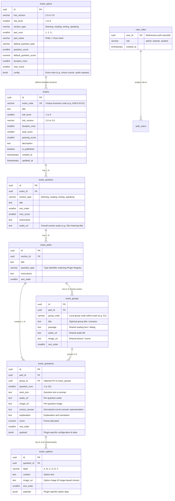

# Plan: HSK Exam Import System

> **Status:** Draft for Review  
> **Document Location:** `docs/plans/exam-import.md`  
> **Target System:** Mayo Creative Chinese (MCC)  
> **Stack:** Angular 21 (Zoneless, Signals), Supabase (Postgres 15, Auth, Storage, PostgREST), Vercel

---

## Table of Contents
1. [Step 0: Audit Findings](#step-0-audit-findings)
2. [Gap Analysis: Current State vs Requirements](#gap-analysis-current-state-vs-requirements)
3. [Proposed Data Model & Database Migrations](#proposed-data-model--database-migrations)
4. [Question Types Plugin Architecture](#question-types-plugin-architecture)
5. [Template Specification (.xlsx + ZIP)](#template-specification-xlsx--zip)
6. [Import Pipeline Architecture & Flow](#import-pipeline-architecture--flow)
7. [Supabase CLI Migration Workflow](#supabase-cli-migration-workflow)
8. [Auth, Roles & RLS Security Design](#auth-roles--rls-security-design)
9. [Phased Implementation Breakdown (Execution-Ready)](#phased-implementation-breakdown-execution-ready)
10. [Risks, Assumptions & Open Questions](#risks-assumptions--open-questions)

---

## Step 0: Audit Findings

Every finding below has been verified against the physical files in `e:\MayoCreativeChinese`.

### 1. Question Types: Modeling, Rendering, Graded
*   **Enums & Models**: Defined in [src/app/features/exams/models/exam.model.ts](file:///e:/MayoCreativeChinese/src/app/features/exams/models/exam.model.ts#L11-L18). Seven types exist:
    `single_choice`, `true_false`, `fill_blank`, `ordering`, `matching`, `short_answer`, `essay`.
*   **Database Modeling**:
    *   Defined in [src/app/features/exams/data/001-exam-schema.sql](file:///e:/MayoCreativeChinese/src/app/features/exams/data/001-exam-schema.sql#L49-L57) as a `CHECK` constraint on `exam_parts.question_type`.
    *   `exam_questions` stores a flat row: `question_num`, `content`, `audio_url`, `image_url`, `correct_answer`, `explanation`, `score`.
    *   `exam_options` stores child rows for options: `label`, `content`, `image_url`, `sort_order`.
*   **Rendering**:
    *   Implemented in [src/app/features/exams/pages/exam-take/exam-take.html](file:///e:/MayoCreativeChinese/src/app/features/exams/pages/exam-take/exam-take.html#L365-L520).
    *   `single_choice`: grid of buttons (A, B, C, D) with optional image preview.
    *   `true_false`: two large buttons for True (对) and False (错).
    *   `fill_blank`: text `<input>` for character/word input.
    *   `ordering`: ordered token badge row + token append buttons (`①`, `②`, `③`, `④`, `⑤`).
    *   `short_answer` & `essay`: `<textarea>` input.
    *   **CRITICAL AUDIT FINDING**: `matching` is defined in the TypeScript type and SQL CHECK constraint, but has **NO rendering branch** in [exam-take.html](file:///e:/MayoCreativeChinese/src/app/features/exams/pages/exam-take/exam-take.html). It falls through to the default `<textarea>` fallback!
*   **Grading**:
    *   Implemented in [src/app/features/exams/services/exam.service.ts](file:///e:/MayoCreativeChinese/src/app/features/exams/services/exam.service.ts#L446-L471) via `checkAnswerCorrectness()`.
    *   `true_false` checks normalized synonyms (`true/t/1/đúng/dung/对/dui` vs `false/f/0/sai/错/cuo`).
    *   `single_choice` and other types strip whitespace, lowercase, and split on alternative delimiters (`/`, `|`, `hoặc`).
    *   `ordering`, `matching`, `short_answer`, `essay` do **not** have custom graders. `essay` is graded by literal string equality.

### 2. Image Support in Stems and Options (Suspicion Check)
*   **Verdict**: **Refuted.** Contrary to the suspicion that neither is supported, **both are already supported** in the data layer and player UI:
    *   **Question Stem Images**: Stored in `exam_questions.image_url` ([001-exam-schema.sql](file:///e:/MayoCreativeChinese/src/app/features/exams/data/001-exam-schema.sql#L72)). Rendered in [exam-take.html](file:///e:/MayoCreativeChinese/src/app/features/exams/pages/exam-take/exam-take.html#L348-L352) and [exam-result.html](file:///e:/MayoCreativeChinese/src/app/features/exams/pages/exam-result/exam-result.html#L289-L293).
    *   **Answer Option Images**: Stored in `exam_options.image_url` ([001-exam-schema.sql](file:///e:/MayoCreativeChinese/src/app/features/exams/data/001-exam-schema.sql#L88)). Rendered in [exam-take.html](file:///e:/MayoCreativeChinese/src/app/features/exams/pages/exam-take/exam-take.html#L392-L394) (`@if (opt.image_url) {  }`).
    *   **Editor Gap**: Although supported in DB and player, the manual editor [question-editor.html](file:///e:/MayoCreativeChinese/src/app/features/exams/components/question-editor/question-editor.html#L95-L131) lacks an image uploader widget inside individual option rows.

### 3. Audio Handling Today
*   **Storage**: Supabase Storage bucket `exam-assets`, subfolder `audio/` via `ExamService.uploadAsset(file, 'audio')` ([exam.service.ts](file:///e:/MayoCreativeChinese/src/app/features/exams/services/exam.service.ts#L305-L334)).
*   **Section-Level Audio**: Stored in `exam_sections.audio_url` ([001-exam-schema.sql](file:///e:/MayoCreativeChinese/src/app/features/exams/data/001-exam-schema.sql#L38)). Rendered as a sticky audio bar with play/pause and seek controls in [exam-take.html](file:///e:/MayoCreativeChinese/src/app/features/exams/pages/exam-take/exam-take.html#L203-L250).
*   **Question-Level Audio**: Stored in `exam_questions.audio_url` ([001-exam-schema.sql](file:///e:/MayoCreativeChinese/src/app/features/exams/data/001-exam-schema.sql#L71)). Rendered as an inline player in [exam-take.html](file:///e:/MayoCreativeChinese/src/app/features/exams/pages/exam-take/exam-take.html#L342-L345).
*   **Group-Level Audio**: **NOT supported**. No "Group" table or concept exists in the database or models. Questions cannot currently share a listening passage without duplicating the URL on every question.

### 4. Database Schema, Migrations & Supabase CLI
*   **Current Tables**: 5 tables in [001-exam-schema.sql](file:///e:/MayoCreativeChinese/src/app/features/exams/data/001-exam-schema.sql):
    `exams`, `exam_sections`, `exam_parts`, `exam_questions`, `exam_options`.
*   **Migration Files**:
    *   `src/app/features/exams/data/001-exam-schema.sql`
    *   `src/app/features/exams/data/002-exam-seed-data.sql`
    *   `src/app/features/flashcards/data/003-vocab-version-migration.sql`
    *   `src/app/features/flashcards/data/seed-hsk-1-3.sql`
*   **Supabase CLI Status**: **NOT in use**.
    *   No `supabase/` directory exists.
    *   No `supabase/config.toml` exists.
    *   No CLI migration scripts in [package.json](file:///e:/MayoCreativeChinese/package.json).
    *   Migrations have been executed manually by copying/pasting SQL into the Supabase Web SQL Editor.

### 5. Authentication, Roles & RLS
*   **Authentication**: **Zero auth implementation**. No login screen, no auth service, no tokens stored.
*   **Guards**: No Angular route guards (`canActivate`) anywhere in the application.
*   **Routes**: `/exams/manage`, `/exams/new`, `/exams/:id/edit`, `/flashcards/manage` are completely public.
*   **RLS Policies**: RLS is enabled on all exam tables in [001-exam-schema.sql](file:///e:/MayoCreativeChinese/src/app/features/exams/data/001-exam-schema.sql#L125-L135), but has open policies: `FOR ALL USING (true) WITH CHECK (true)` allowing anyone with the public anon key full read and write access.

### 6. Existing Reusable Import / Upload Code
*   **Spreadsheet Parsing**: [file-parser.util.ts](file:///e:/MayoCreativeChinese/src/app/features/flashcards/utils/file-parser.util.ts) dynamically imports `xlsx`, parses `.xlsx` and `.csv`, sanitizes headers, maps columns, and validates rows.
*   **Template Generation**: [template-generator.util.ts](file:///e:/MayoCreativeChinese/src/app/features/flashcards/utils/template-generator.util.ts) creates formatted Excel sheets with column widths and triggers browser downloads.
*   **Preview UI Component**: [import-preview.ts](file:///e:/MayoCreativeChinese/src/app/features/flashcards/components/import-preview/import-preview.ts) provides summary metrics (valid, duplicate, error counts), row selection toggles, and status badges.
*   **Storage Uploads**: [exam.service.ts](file:///e:/MayoCreativeChinese/src/app/features/exams/services/exam.service.ts#L305) contains `uploadAsset(file, 'audio' | 'images')`.
*   **ZIP Handling**: **None**. No ZIP library or extraction code currently exists in the repository.

---

## Gap Analysis: Current State vs Requirements

| Dimension | Current State | Required State | Gap / Action |
| :--- | :--- | :--- | :--- |
| **Data Hierarchy** | Exam -> Section -> Part -> Question -> Option (4 tiers) | Exam -> Section -> Part -> Group (optional) -> Question -> Option (5 tiers) | Need `exam_groups` table to hold shared audio, image, and reading passage for N questions. |
| **Question Types Architecture** | Hardcoded monolithic `CHECK` constraint on `exam_parts`, single giant `@if/else` block in `exam-take.html`, simple string matcher in `exam.service.ts`. | **Plugin Architecture**: Each type = JSON Schema + Angular component + Grader function. Payload stored in `payload JSONB`. | Decouple question type from DB column structure. Use JSONB payload on `exam_questions`. Create registry service. |
| **HSK Spec Configuration** | Hardcoded in `initDefaultStructure()` and UI mocks. | Config-driven `exam_specs` table defining version, level, sections, parts, question counts, duration, scoring, passing rules. | Create `exam_specs` table & pre-populate official specs for HSK 2.0 (L1-6) and HSK 3.0 (L1-9). |
| **Exam Identity & Idempotence** | Only UUID `id`. No business key. | Unique `exam_code` (e.g. `HSK3-2.0-TEST01`). Re-importing updates the existing exam atomically. | Add `exam_code VARCHAR(50) UNIQUE` to `exams`. Update RPC must do atomic delete-and-replace or upsert. |
| **Import Template** | None for exams (only single-sheet CSV/XLSX for flashcards). | Multi-sheet `.xlsx` (`exams`, `sections`, `groups`, `questions`, `options`) + ZIP of media files. | Implement multi-sheet Excel parser + JSZip extractor + cross-sheet relational validator. |
| **Import Pipeline** | None for exams. | Browser parse -> cross-sheet validation -> media check -> visual preview -> atomic Postgres RPC commit. | Build full client-side pipeline with per-cell error reporting and atomic DB commit. |
| **Media Resolution** | Only manual file pickers in editor. | Excel references media by relative filename (`audio_q1.mp3`). Pipeline extracts from ZIP and uploads to Supabase Storage. | Implement ZIP unpacking, filename-to-storage-URL map, batch upload with concurrency control. |
| **Database Migrations** | Loose `.sql` files manually run in Supabase UI. No `supabase/` folder. | Supabase CLI migrations workflow (`supabase/migrations/*.sql`). | Initialize Supabase CLI config, establish sequential migration files. |
| **Security & Roles** | Unauthenticated, open RLS (`true`). | Supabase Auth + role check (`admin` \| `teacher`) enforced in RLS and Angular route guards. | Implement Supabase Auth service, `user_roles` table, restrictive RLS policies, and Angular AuthGuard. |

---

## Proposed Data Model & Database Migrations

### Entity-Relationship Diagram



### Migration File Plan

The schema changes will be split into cleanly ordered, idempotent migration files under `supabase/migrations/`:

#### `20260925000001_exam_schema_v2.sql`
1.  **Add `exam_code` to `exams`**:
    ```sql
    ALTER TABLE exams ADD COLUMN IF NOT EXISTS exam_code VARCHAR(50);
    CREATE UNIQUE INDEX IF NOT EXISTS idx_exams_exam_code ON exams(exam_code);
    ```
2.  **Create `exam_groups` Table**:
    ```sql
    CREATE TABLE IF NOT EXISTS exam_groups (
      id          UUID PRIMARY KEY DEFAULT gen_random_uuid(),
      part_id     UUID NOT NULL REFERENCES exam_parts(id) ON DELETE CASCADE,
      group_code  VARCHAR(50),
      title       TEXT,
      passage     TEXT,
      audio_url   TEXT,
      image_url   TEXT,
      sort_order  SMALLINT NOT NULL DEFAULT 0,
      created_at  TIMESTAMPTZ NOT NULL DEFAULT now()
    );
    CREATE INDEX IF NOT EXISTS idx_groups_part ON exam_groups(part_id, sort_order);
    ```
3.  **Upgrade `exam_questions` Table**:
    *   Add `group_id UUID REFERENCES exam_groups(id) ON DELETE SET NULL`.
    *   Rename `content` to `stem_text` (or keep `stem_text` as alias, migrate data).
    *   Add `payload JSONB NOT NULL DEFAULT '{}'::jsonb`.
    *   Remove restrictive CHECK constraint on `exam_parts.question_type` to allow plugins without schema migrations.
    ```sql
    ALTER TABLE exam_parts DROP CONSTRAINT IF EXISTS exam_parts_question_type_check;
    ALTER TABLE exam_questions ADD COLUMN IF NOT EXISTS group_id UUID REFERENCES exam_groups(id) ON DELETE SET NULL;
    ALTER TABLE exam_questions ADD COLUMN IF NOT EXISTS payload JSONB NOT NULL DEFAULT '{}'::jsonb;
    ALTER TABLE exam_questions ADD COLUMN IF NOT EXISTS stem_text TEXT;
    UPDATE exam_questions SET stem_text = content WHERE stem_text IS NULL AND content IS NOT NULL;
    ```
4.  **Upgrade `exam_options` Table**:
    ```sql
    ALTER TABLE exam_options ADD COLUMN IF NOT EXISTS payload JSONB NOT NULL DEFAULT '{}'::jsonb;
    ```

#### `20260925000002_exam_specs.sql`
Creates the `exam_specs` table and populates the official specifications for HSK 2.0 (Levels 1 to 6) and HSK 3.0 (Levels 1 to 9).
```sql
CREATE TABLE IF NOT EXISTS exam_specs (
  id                      UUID PRIMARY KEY DEFAULT gen_random_uuid(),
  hsk_version             VARCHAR(10) NOT NULL CHECK (hsk_version IN ('2.0', '3.0')),
  hsk_level               SMALLINT NOT NULL CHECK (hsk_level BETWEEN 1 AND 9),
  section_type            VARCHAR(20) NOT NULL CHECK (section_type IN ('listening', 'reading', 'writing', 'speaking')),
  part_num                SMALLINT NOT NULL,
  part_name               TEXT NOT NULL,
  default_question_type   VARCHAR(50) NOT NULL,
  question_count          SMALLINT NOT NULL,
  default_question_score  NUMERIC(4, 2) NOT NULL DEFAULT 2.50,
  duration_mins           SMALLINT,
  max_score               SMALLINT NOT NULL DEFAULT 100,
  config                  JSONB NOT NULL DEFAULT '{}'::jsonb,
  created_at              TIMESTAMPTZ NOT NULL DEFAULT now(),
  CONSTRAINT uq_exam_spec UNIQUE (hsk_version, hsk_level, section_type, part_num)
);
```

#### `20260925000003_auth_roles_and_rls.sql`
Implements the user roles table, helper function, and role-restricted RLS policies.
```sql
CREATE TABLE IF NOT EXISTS user_roles (
  user_id    UUID PRIMARY KEY REFERENCES auth.users(id) ON DELETE CASCADE,
  role       VARCHAR(20) NOT NULL CHECK (role IN ('admin', 'teacher', 'student')),
  created_at TIMESTAMPTZ NOT NULL DEFAULT now()
);

ALTER TABLE user_roles ENABLE ROW LEVEL SECURITY;

CREATE OR REPLACE FUNCTION current_user_role()
RETURNS VARCHAR(20) AS $$
  SELECT role FROM public.user_roles WHERE user_id = auth.uid();
$$ LANGUAGE sql STABLE SECURITY DEFINER;

-- RLS Update on exams
DROP POLICY IF EXISTS "Allow public full access on exams" ON exams;
CREATE POLICY "Public read published exams" ON exams FOR SELECT USING (is_published = true OR current_user_role() IN ('admin', 'teacher'));
CREATE POLICY "Staff manage exams" ON exams FOR ALL USING (current_user_role() IN ('admin', 'teacher')) WITH CHECK (current_user_role() IN ('admin', 'teacher'));

-- Similar policies for sections, parts, groups, questions, options
```

#### `20260925000004_rpc_import_exam.sql`
Creates the atomic database procedure `import_exam_bundle(exam_data JSONB)` that runs in a single transaction.

---

## Question Types Plugin Architecture

### Architectural Design
A question type is defined by a self-contained TypeScript module conforming to the `QuestionPlugin` interface:

```typescript
export interface QuestionPlugin<TPayload = any, TUserAnswer = any> {
  type: string;                    // e.g. 'single_choice', 'true_false', 'ordering'
  displayName: string;             // e.g. 'Trắc nghiệm 1 đáp án'
  description: string;
  schema: ZodSchema<TPayload>;     // Zod validation schema for the JSONB payload

  // Angular Component type for rendering in the exam taker
  takeComponent: Type<QuestionTakeComponent<TPayload, TUserAnswer>>;

  // Angular Component type for rendering in the result viewer
  resultComponent: Type<QuestionResultComponent<TPayload, TUserAnswer>>;

  // Pure grader function
  grade(params: {
    userAnswer: TUserAnswer;
    correctAnswer: string;
    payload: TPayload;
    options?: ExamOption[];
    maxScore: number;
  }): { isCorrect: boolean; scoreEarned: number; feedback?: string };

  // Parse Excel row options into payload format
  parseExcelOptions?(options: ParsedOptionRow[]): TPayload;
}
```

### Initial Core Plugins (Phase 1)

#### 1. `single_choice` (Trắc nghiệm 1 đáp án)
*   **Payload Schema**:
    ```typescript
    const SingleChoicePayloadSchema = z.object({
      layout: z.enum(['vertical', 'grid_2x2', 'horizontal']).default('grid_2x2'),
      shuffleOptions: z.boolean().default(false),
    });
    ```
*   **Stem & Option Images**: Supported. Stem image appears in `q.image_url`; each option in `options` has `image_url`.
*   **Grading**: Strict equality on `userAnswer.toUpperCase() === correctAnswer.toUpperCase()`.

#### 2. `true_false` (Phán đoán Đúng / Sai)
*   **Payload Schema**:
    ```typescript
    const TrueFalsePayloadSchema = z.object({
      trueLabel: z.string().default('对 (Đúng)'),
      falseLabel: z.string().default('错 (Sai)'),
    });
    ```
*   **Stem & Option Images**: Stem image supported (used in HSK 1-3 listening/reading picture judgment). Options are implicit True/False buttons.
*   **Grading**: Canonical normalization (`true/t/1/đúng/对` -> `'true'`, `false/f/0/sai/错` -> `'false'`).

#### 3. `fill_blank` (Điền vào chỗ trống)
*   **Payload Schema**:
    ```typescript
    const FillBlankPayloadSchema = z.object({
      caseSensitive: z.boolean().default(false),
      ignorePunctuation: z.boolean().default(true),
      alternativeAnswers: z.array(z.string()).default([]),
      wordBankId: z.string().optional(), // Reference to shared group word bank
    });
    ```
*   **Grading**: Normalizes spaces and punctuation; matches against `correct_answer` or any `alternativeAnswers`.

#### 4. `ordering` (Sắp xếp câu)
*   **Payload Schema**:
    ```typescript
    const OrderingPayloadSchema = z.object({
      tokens: z.array(z.object({
        id: z.string(),
        label: z.string(), // e.g. '①', '②'
        text: z.string(),  // e.g. '那只猫', '在桌子下面'
      })),
      allowDragDrop: z.boolean().default(true),
    });
    ```
*   **Grading**: Strips non-identifier characters and compares sequence (e.g. `①④②③` vs `1-4-2-3`).

#### 5. `short_answer` (Viết chữ Hán theo Pinyin)
*   **Payload Schema**:
    ```typescript
    const ShortAnswerPayloadSchema = z.object({
      pinyinPrompt: z.string(), // e.g. 'tīan'
      strokeCountHint: z.number().optional(),
      alternativeCharacters: z.array(z.string()).default([]),
    });
    ```
*   **Grading**: Unicode-trimmed character match against `correct_answer` and `alternativeCharacters`.

### Plugin Registry Service (`QuestionPluginRegistry`)
A singleton Angular service that registers plugins at application bootstrap. The `ExamTakeComponent` and `ExamResultComponent` query the registry and dynamically render components via Angular's `NgComponentOutlet`.

```typescript
@Injectable({ providedIn: 'root' })
export class QuestionPluginRegistry {
  private plugins = new Map<string, QuestionPlugin>();

  register(plugin: QuestionPlugin): void {
    this.plugins.set(plugin.type, plugin);
  }

  get(type: string): QuestionPlugin {
    const p = this.plugins.get(type);
    if (!p) throw new Error(`Unsupported question type plugin: [${type}]`);
    return p;
  }
}
```

---

## Template Specification (.xlsx + ZIP)

### Package Structure
An exam import bundle consists of:
1.  **`exam.xlsx`** (Single workbook with 5 mandatory sheets)
2.  **`media/`** (Folder or root inside ZIP containing all referenced audio and image files)

### Sheet 1: `exams` (1 row per file)
Defines root exam metadata.

| Column | Type | Required | Description / Rules | Example |
| :--- | :--- | :---: | :--- | :--- |
| `exam_code` | String | **Yes** | Unique business identifier. Idempotence key. | `HSK3-2.0-TEST01` |
| `title` | String | **Yes** | Exam display title. Max 255 chars. | `HSK 3 — Đề thi thử tiêu chuẩn số 01` |
| `hsk_version` | Enum | **Yes** | Must be `2.0` or `3.0`. | `2.0` |
| `hsk_level` | Int | **Yes** | Integer `1` to `6` (for 2.0) or `1` to `9` (for 3.0). | `3` |
| `duration_mins` | Int | **Yes** | Total test time in minutes (10 - 240). | `90` |
| `total_score` | Int | **Yes** | Standard score ceiling (usually 200 or 300). | `300` |
| `passing_score`| Int | **Yes** | Passing threshold (usually 120 or 180). | `180` |
| `description` | String | No | General instructions / center notes. | `Đề thi thử định dạng HSK 2.0 chuẩn.` |
| `is_published` | Boolean| No | `TRUE` or `FALSE` (defaults to `FALSE`). | `FALSE` |

### Sheet 2: `sections`
Defines major test sections (Listening, Reading, Writing, Speaking).

| Column | Type | Required | Description / Rules | Example |
| :--- | :--- | :---: | :--- | :--- |
| `section_code` | String | **Yes** | Unique within file (e.g. `SEC_LIS`, `SEC_READ`). | `SEC_LIS` |
| `section_type` | Enum | **Yes** | `listening`, `reading`, `writing`, or `speaking`. | `listening` |
| `title` | String | **Yes** | Display title. | `Phần 1: Nghe hiểu (听力)` |
| `sort_order` | Int | **Yes** | Sequence order (1, 2, 3...). | `1` |
| `max_score` | Int | **Yes** | Points ceiling (usually 100). | `100` |
| `instructions` | String | No | Section instructions displayed to learner. | `Gồm 40 câu hỏi, thời gian nghe 35 phút.`|
| `audio_file` | String | No | Relative filename in ZIP for full-section audio. | `hsk3_01_listening_full.mp3` |

### Sheet 3: `parts`
Defines parts/tasks within sections.

| Column | Type | Required | Description / Rules | Example |
| :--- | :--- | :---: | :--- | :--- |
| `part_code` | String | **Yes** | Unique within file (e.g. `P_LIS_1`). | `P_LIS_1` |
| `section_code` | String | **Yes** | Must match `section_code` in `sections` sheet. | `SEC_LIS` |
| `title` | String | **Yes** | Part title. | `Phần I: Câu 1-10 (Chọn hình phù hợp)` |
| `question_type`| String | **Yes** | Registered plugin type (`single_choice`, etc.). | `single_choice` |
| `instructions` | String | No | Task instructions. | `Nghe đoạn đối thoại và chọn đáp án.` |
| `sort_order` | Int | **Yes** | Sequence within section. | `1` |

### Sheet 4: `groups` (Optional for parts without shared stimuli)
Defines shared reading passages, scenario dialogues, or shared audio tracks for multi-question sets.

| Column | Type | Required | Description / Rules | Example |
| :--- | :--- | :---: | :--- | :--- |
| `group_code` | String | **Yes** | Unique within file (e.g. `GRP_READ_1`). | `GRP_READ_1` |
| `part_code` | String | **Yes** | Must match `part_code` in `parts` sheet. | `P_READ_1` |
| `title` | String | No | Optional label (e.g. `Đoạn văn 1`). | `Đoạn văn số 1 (Câu 21-25)` |
| `passage` | String | No | Shared reading passage / Chinese text. | `昨天我和朋友一起去超市买水果...` |
| `audio_file` | String | No | Shared audio filename in ZIP. | `dialogue_passage_1.mp3` |
| `image_file` | String | No | Shared image filename in ZIP. | `scene_reading_1.png` |
| `sort_order` | Int | **Yes** | Sequence within part. | `1` |

### Sheet 5: `questions`
Defines individual questions.

| Column | Type | Required | Description / Rules | Example |
| :--- | :--- | :---: | :--- | :--- |
| `question_num` | Int | **Yes** | Absolute 1-based index (1 to N). Must be unique. | `1` |
| `part_code` | String | **Yes** | Must match `part_code` in `parts` sheet. | `P_LIS_1` |
| `group_code` | String | No | Optional. Matches `group_code` in `groups`. | `GRP_LIS_1` |
| `stem_text` | String | No | Question prompt / sentence. | `男：请问，洗手间在哪儿？\n女：在前面。` |
| `audio_file` | String | No | Per-question audio filename in ZIP. | `q1_audio.mp3` |
| `image_file` | String | No | Per-question image filename in ZIP. | `q1_pic.png` |
| `correct_answer`| String| **Yes** | Correct answer key (`A`, `true`, `①④②③`, `天`). | `B` |
| `score` | Decimal| **Yes** | Point value for this question (e.g. 2.5). | `2.5` |
| `explanation` | String | No | Analysis and Vietnamese translation. | `Nam hỏi nhà vệ sinh ở đâu -> Đáp án B.` |
| `payload_json` | JSON | No | Optional JSON string for plugin extra config. | `{"shuffleOptions": false}` |

### Sheet 6: `options`
Defines choices for `single_choice` or `matching`.

| Column | Type | Required | Description / Rules | Example |
| :--- | :--- | :---: | :--- | :--- |
| `question_num` | Int | **Yes** | Must match `question_num` in `questions`. | `1` |
| `label` | String | **Yes** | Option key (`A`, `B`, `C`, `D`, `E`, `F`). | `A` |
| `content` | String | No | Text content of option. Required if no image. | `教室 (Phòng học)` |
| `image_file` | String | No | Option image filename in ZIP. | `opt_1a.png` |
| `sort_order` | Int | **Yes** | Display sequence. | `1` |

---

### Worked Example: Small End-to-End Bundle

#### File: `HSK3_Sample.xlsx`
**Sheet: `exams`**
```
exam_code,title,hsk_version,hsk_level,duration_mins,total_score,passing_score,description,is_published
HSK3-20-MINI,HSK 3 Mini Sample,2.0,3,15,50,30,Đề thi mẫu thu nhỏ kiểm tra import,TRUE
```

**Sheet: `sections`**
```
section_code,section_type,title,sort_order,max_score,instructions,audio_file
SEC_LIS,listening,Phần 1: Nghe hiểu,1,30,Nghe và trả lời,hsk3_sec1.mp3
SEC_READ,reading,Phần 2: Đọc hiểu,2,20,Đọc kỹ đoạn văn,
```

**Sheet: `parts`**
```
part_code,section_code,title,question_type,instructions,sort_order
P1,SEC_LIS,Part 1: Chọn tranh,single_choice,Nghe và chọn hình đúng,1
P2,SEC_READ,Part 2: Đúng Sai,true_false,Phán đoán đúng sai,1
```

**Sheet: `groups`**
```
group_code,part_code,title,passage,audio_file,image_file,sort_order
G_READ,P2,Đoạn đọc mẫu,小明每天早上七点起床去学校。,,school.png,1
```

**Sheet: `questions`**
```
question_num,part_code,group_code,stem_text,audio_file,image_file,correct_answer,score,explanation,payload_json
1,P1,,男：你要喝茶还是咖啡？女：茶吧。,,q1_prompt.png,A,10,Nữ chọn trà -> Hình A,
2,P2,G_READ,小明每天下午去学校。,,,false,10,Đoạn văn nói早上七点 -> Sai,
```

**Sheet: `options`**
```
question_num,label,content,image_file,sort_order
1,A,Trà,tea.png,1
1,B,Cà phê,coffee.png,2
```

#### Media ZIP Contents:
```text
bundle.zip
├── exam.xlsx
├── media/
│   ├── hsk3_sec1.mp3
│   ├── school.png
│   ├── q1_prompt.png
│   ├── tea.png
│   └── coffee.png
```

---

## Import Pipeline Architecture & Flow

### User Interface Workflow
```
[Select .xlsx + .zip] 
       │
       ▼
[Client-Side Parsing & Validation] 
       │ ── Errors? ──> [Show Error Grid with sheet/row/cell highlights] (Abort)
       ▼
[Media Verification] 
       │ ── Missing files? ──> [Show Missing Media List] (Abort)
       ▼
[Interactive Preview Modal]
       │ ── User reviews question hierarchy & media previews
       ▼
[Batch Upload Media to Supabase Storage]
       │ ── Progress bar with concurrent chunking
       ▼
[Atomic Database Commit via Postgres RPC]
       │ ── Upsert exam, cascade replace sub-tables
       ▼
[Success Redirect to /exams/:id/edit or /exams/manage]
```

### 1. Step-by-Step Validation Rules
The browser executes validation before any media upload or database call occurs:

1.  **Workbook Integrity**:
    *   All 5 sheets (`exams`, `sections`, `parts`, `questions`, `options`) must be present.
    *   Sheet `exams` must contain exactly 1 row.
2.  **Relational Integrity**:
    *   Every `part.section_code` must exist in `sections`.
    *   Every `group.part_code` must exist in `parts`.
    *   Every `question.part_code` must exist in `parts`.
    *   Every `question.group_code` (if not null) must exist in `groups`.
    *   Every `option.question_num` must exist in `questions`.
3.  **HSK Spec Conformance**:
    *   Lookup matching `exam_specs` record for `(hsk_version, hsk_level)`.
    *   Verify question count matches the expected spec count (warn or flag error depending on strict mode).
    *   Verify total score equals the sum of all question scores.
4.  **Question & Option Rules**:
    *   `single_choice`: `correct_answer` must match one of the defined option labels (`A`, `B`, etc.).
    *   `true_false`: `correct_answer` must normalize to `'true'` or `'false'`. Options sheet must not have rows for this question.
    *   `ordering`: `correct_answer` must define a sequence of valid tokens.
    *   `single_choice` question must have at least 2 options.
    *   Every option must have either text `content` or an `image_file` (or both).
5.  **Media Verification**:
    *   Every non-empty value in `audio_file`, `image_file` across all sheets must match a valid file inside the uploaded ZIP.
    *   File size checks: images < 5MB, individual audio clips < 20MB, full listening tracks < 100MB.

### 2. Media Upload Strategy
*   Files are unzipped using `JSZip` in memory as `Blob` objects.
*   Media files are uploaded to the Supabase Storage bucket `exam-assets`:
    *   Audio path: `audio/{exam_code}/{filename}`
    *   Images path: `images/{exam_code}/{filename}`
*   Concurrency: Uploaded using `p-limit` or batch promises (4 concurrent uploads) to prevent browser connection starvation.
*   Generates a lookup map: `Map<localFilename, publicStorageUrl>`.
*   The raw filenames in the parsed JSON payload are replaced with their permanent `publicStorageUrl` values before database commit.

### 3. Atomic Database RPC: `import_exam_bundle(exam_data JSONB)`
To ensure complete transactional safety and idempotence:
*   A Postgres function `import_exam_bundle` accepts the fully resolved JSON structure.
*   **Idempotence**: It queries `exams` by `exam_code`.
    *   If found: updates root exam fields, cascades deletion of old sections (which cascades parts, groups, questions, options).
    *   If not found: inserts a new record into `exams`.
*   Inserts all sections, parts, groups, questions, and options in a single SQL transaction.
*   If any insertion fails, the entire transaction rolls back automatically.

---

## Supabase CLI Migration Workflow

The repository currently lacks the `supabase/` folder. We must configure the official Supabase CLI workflow without breaking existing workflows:

1.  **Project Initialization**:
    *   Initialize `supabase/config.toml` targeting PostgreSQL 15.
    *   Establish `supabase/migrations/` directory.
2.  **Baseline Migration**:
    *   `20260925000000_baseline_schema.sql`: Consolidates existing tables from `001-exam-schema.sql` and `vocab_cards` into a clean starting state.
3.  **Incremental Migrations**:
    *   `20260925000001_exam_schema_v2.sql` (exam_code, exam_groups, jsonb payload).
    *   `20260925000002_exam_specs.sql` (specification table & seed data).
    *   `20260925000003_auth_roles_and_rls.sql` (roles, auth functions, RLS).
    *   `20260925000004_rpc_import_exam.sql` (atomic import stored procedure).
4.  **NPM Scripts**:
    Add convenience scripts to `package.json`:
    ```json
    "scripts": {
      "db:lint": "npx supabase db lint",
      "db:diff": "npx supabase db diff",
      "db:push": "npx supabase db push"
    }
    ```

---

## Auth, Roles & RLS Security Design

### User Roles Data Model
```sql
CREATE TABLE public.user_roles (
  user_id    UUID PRIMARY KEY REFERENCES auth.users(id) ON DELETE CASCADE,
  role       VARCHAR(20) NOT NULL CHECK (role IN ('admin', 'teacher', 'student')),
  created_at TIMESTAMPTZ NOT NULL DEFAULT now()
);

ALTER TABLE public.user_roles ENABLE ROW LEVEL SECURITY;

CREATE POLICY "Users can read own role"
  ON public.user_roles FOR SELECT
  USING (auth.uid() = user_id);
```

### Angular Route Protection
1.  **`AuthService`**: Wraps Supabase Auth (`supabase.auth.getSession()`, `supabase.auth.onAuthStateChange()`).
2.  **`RoleGuard`**: Functional CanActivate guard checking if `authService.currentRole()` matches `'admin'` or `'teacher'`.
    ```typescript
    export const adminOrTeacherGuard: CanActivateFn = () => {
      const auth = inject(AuthService);
      const router = inject(Router);
      if (auth.hasRole(['admin', 'teacher'])) {
        return true;
      }
      return router.createUrlTree(['/login'], { queryParams: { error: 'unauthorized' } });
    };
    ```
3.  **Protected Routes**:
    *   `/exams/manage` -> protected by `adminOrTeacherGuard`
    *   `/exams/new` -> protected by `adminOrTeacherGuard`
    *   `/exams/:id/edit` -> protected by `adminOrTeacherGuard`
    *   `/exams/import` -> protected by `adminOrTeacherGuard`

---

## Phased Implementation Breakdown (Execution-Ready)

The plan is structured into small, self-contained, sequential tasks designed to be executed without design ambiguity.

### Phase 1: Thin Vertical Slice (HSK 3 Standard, HSK 2.0, End-to-End)

#### Task 1.1: Supabase CLI Setup & Baseline Migration
*   **Goal**: Initialize Supabase CLI structure and create baseline schema migration.
*   **Files to create**:
    *   `supabase/config.toml`
    *   `supabase/migrations/20260925000000_baseline_schema.sql`
*   **Inputs**: Existing `src/app/features/exams/data/001-exam-schema.sql` and `src/app/features/flashcards/data/003-vocab-version-migration.sql`.
*   **Outputs**: Working Supabase CLI migrations directory.
*   **Acceptance Criteria**: Running `npx supabase db lint` succeeds without fatal syntax errors.
*   **Verification**: Run `Test-Path "supabase/migrations/20260925000000_baseline_schema.sql"` in PowerShell.

#### Task 1.2: Database Migration for Exam V2 Schema
*   **Goal**: Add `exam_code`, `exam_groups`, `payload JSONB` on questions and options, and drop hardcoded question type check.
*   **Files to create**:
    *   `supabase/migrations/20260925000001_exam_schema_v2.sql`
*   **Acceptance Criteria**:
    *   Table `exam_groups` created with FK to `exam_parts`.
    *   `exam_questions` has columns `group_id`, `stem_text`, `payload`.
    *   `exams` has `exam_code VARCHAR(50) UNIQUE`.
*   **Verification**: Check table definition syntax and FK references.

#### Task 1.3: Database Migration for Exam Specs Table
*   **Goal**: Create `exam_specs` table and seed data for HSK 2.0 Level 3 (80 questions: Listening 40, Reading 30, Writing 10).
*   **Files to create**:
    *   `supabase/migrations/20260925000002_exam_specs.sql`
*   **Outputs**: SQL migration seeding HSK 3 specs.
*   **Verification**: SQL script runs idempotently using `INSERT ... ON CONFLICT DO NOTHING`.

#### Task 1.4: Database Atomic Import RPC Function
*   **Goal**: Create stored procedure `import_exam_bundle(exam_data JSONB)` that inserts/updates exam hierarchically in one transaction.
*   **Files to create**:
    *   `supabase/migrations/20260925000004_rpc_import_exam.sql`
*   **Inputs**: JSON schema containing nested sections -> parts -> groups -> questions -> options.
*   **Outputs**: Returns `{ success: true, exam_id: UUID, exam_code: TEXT }`.
*   **Verification**: Tested via Supabase RPC call with sample payload.

#### Task 1.5: TypeScript Models & Spec Definitions
*   **Goal**: Update TypeScript interfaces in `exam.model.ts` to reflect `exam_code`, `exam_groups`, `payload`, and `ExamSpec`.
*   **Files to modify**:
    *   `src/app/features/exams/models/exam.model.ts`
*   **Acceptance Criteria**: Strict typing for `ExamGroup`, `ExamQuestion.payload`, `ExamOption.payload`, `ExamSpec`.
*   **Verification**: Run `npm run build` to confirm no type regression in existing code.

#### Task 1.6: Install Required Libraries (`jszip`)
*   **Goal**: Add `jszip` and its types for browser-based ZIP file extraction.
*   **Commands**:
    *   `npm install jszip`
    *   `npm install --save-dev @types/jszip`
*   **Files to modify**: `package.json`
*   **Verification**: Check `package.json` dependencies.

#### Task 1.7: Question Plugin Registry & Core Plugins
*   **Goal**: Build the extensible plugin architecture for question rendering and grading.
*   **Files to create**:
    *   `src/app/features/exams/plugins/question-plugin.interface.ts`
    *   `src/app/features/exams/plugins/question-plugin.registry.ts`
    *   `src/app/features/exams/plugins/single-choice/single-choice.plugin.ts`
    *   `src/app/features/exams/plugins/true-false/true-false.plugin.ts`
    *   `src/app/features/exams/plugins/fill-blank/fill-blank.plugin.ts`
    *   `src/app/features/exams/plugins/ordering/ordering.plugin.ts`
    *   `src/app/features/exams/plugins/short-answer/short-answer.plugin.ts`
*   **Verification**: Unit tests for grader functions with known test cases.

#### Task 1.8: Excel Parser & Cross-Sheet Validator Service
*   **Goal**: Build the browser service that parses multi-sheet `.xlsx` files and validates cross-sheet integrity.
*   **Files to create**:
    *   `src/app/features/exams/services/exam-parser.service.ts`
    *   `src/app/features/exams/services/exam-parser.service.spec.ts`
*   **Acceptance Criteria**:
    *   Parses sheets `exams`, `sections`, `parts`, `groups`, `questions`, `options`.
    *   Returns detailed row-level error list: `{ sheet: string, row: number, column: string, message: string }`.
*   **Verification**: Run unit tests with valid and invalid Excel fixture buffers.

#### Task 1.9: Media Extraction & Storage Upload Service
*   **Goal**: Build the service that extracts media from ZIP and coordinates uploads to Supabase Storage.
*   **Files to create**:
    *   `src/app/features/exams/services/exam-media.service.ts`
*   **Acceptance Criteria**:
    *   Matches filenames from parsed Excel to ZIP entries.
    *   Uploads in throttled batches to `exam-assets/{type}/{exam_code}/{filename}`.
    *   Returns URL replacement map.
*   **Verification**: Unit test mocking Supabase storage client.

#### Task 1.10: Import UI Page & Visual Preview Component
*   **Goal**: Build the Angular page where teachers drag/drop `.xlsx` + `.zip`, view validation errors, inspect the visual preview, and click Commit.
*   **Files to create**:
    *   `src/app/features/exams/pages/exam-import/exam-import.ts`
    *   `src/app/features/exams/pages/exam-import/exam-import.html`
    *   `src/app/features/exams/pages/exam-import/exam-import.css`
    *   `src/app/features/exams/components/import-validation-summary/import-validation-summary.ts`
    *   `src/app/features/exams/components/import-exam-preview/import-exam-preview.ts`
*   **Routing**: Add `/exams/import` route to `src/app/features/exams/exam.routes.ts`.
*   **Verification**: Navigate to `/exams/import`, test UI state transitions.

#### Task 1.11: Sample HSK 3 Fixture Package Creation
*   **Goal**: Create a canonical test fixture (`sample-hsk3-import.zip` containing `exam.xlsx` + media files) covering all 5 core question types, group audio, and option images.
*   **Files to create**:
    *   `src/app/features/exams/fixtures/sample-hsk3-bundle.ts` (generator script or static asset).
*   **Verification**: Feed the fixture through `exam-parser.service` and verify 0 validation errors.

#### Task 1.12: End-to-End Verification of Phase 1
*   **Goal**: Run a full vertical slice test: import the HSK 3 sample bundle -> verify DB records -> start test -> submit test -> verify grade.
*   **Verification steps**:
    1. Import bundle via `/exams/import`.
    2. Confirm exam appears in `/exams/manage` with correct question count.
    3. Take exam at `/exams/:id/take`, verify rendering of single_choice with image, true_false, fill_blank, ordering, and short_answer.
    4. Submit and verify scoring on `/exams/:id/result`.

---

### Phase 2: Complete HSK 2.0 Coverage (Levels 1–6) & Additional Question Types
*   **Task 2.1**: Implement `matching` Question Type Plugin (2-column line connector / select paired badges).
*   **Task 2.2**: Implement `essay` Question Type Plugin (Character counting, prompt images, teacher manual grade flag).
*   **Task 2.3**: Seed `exam_specs` for HSK 2.0 Levels 1, 2, 4, 5, 6.
*   **Task 2.4**: Excel template export button: Download pre-formatted `.xlsx` template configured for chosen HSK level.

---

### Phase 3: HSK 3.0 Standard Support (Levels 1–9) & Advanced Media
*   **Task 3.1**: Seed `exam_specs` for HSK 3.0 Elementary (L1-3), Intermediate (L4-6), and Advanced (L7-9).
*   **Task 3.2**: Add speaking and audio recording question types (`audio_recording` plugin using browser MediaRecorder API).
*   **Task 3.3**: Translation question plugin (Chinese <-> Vietnamese bidirectional translation).

---

### Phase 4: Authentication, Authorization & Production Hardening
*   **Task 4.1**: Create `user_roles` migration and apply restrictive RLS policies.
*   **Task 4.2**: Implement `AuthService` and Angular `RoleGuard` on `/exams/manage`, `/exams/editor`, `/exams/import`.
*   **Task 4.3**: Batch re-import diff tool: Preview visual diff before overwriting an existing `exam_code`.

---

## Risks, Assumptions & Open Questions

### Assumptions Made
1.  **Vercel Serverless File Limit**: Because Vercel functions have strict request body limits (4.5MB), the entire parsing, unzipping, and media uploading process is designed to run **entirely client-side in the browser**. Only the structured JSON metadata is posted to Supabase via RPC.
2.  **Supabase Storage**: Bucket `exam-assets` is assumed to remain publicly readable for asset URLs, while write access is authenticated or governed via client tokens.
3.  **Media Naming**: Files in the ZIP must exactly match cell strings (case-insensitive filename resolution is implemented to prevent Windows/Linux mismatch bugs).

### Open Questions for User Review

> [!IMPORTANT]
> **Decision on Existing Exams**: When an exam is re-imported using an existing `exam_code`, should existing student submissions for that exam be preserved, reset, or prevented from re-importing if student submissions exist?
> *Recommendation*: If student submissions exist, re-import should create a new version (e.g. `exam_code_v2`) or require an explicit "Force Overwrite" checkbox that archives old submissions.

> [!WARNING]
> **HSK 3.0 Exam Specifications**: Official question counts and section timing for HSK 3.0 Levels 7-9 remain subject to updates by Hanban / CTI. 
> *Strategy*: All specifications will reside in the `exam_specs` database table as dynamic data rather than hardcoded enums, allowing center administrators to adjust question counts and scoring weights without code deploys.

> [!NOTE]
> **Matching Question Scoring**: In HSK matching tasks (e.g. 5 questions sharing 5-6 option boxes), should partial credit be awarded (e.g. 2.0 points per correct pair), or is the entire group all-or-nothing?
> *Recommendation*: Per-pair scoring (each pair is modeled as a question belonging to the same `group_id`).
